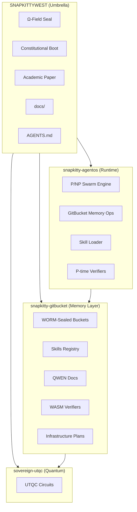
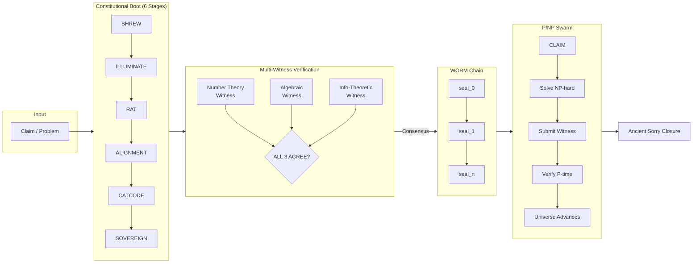
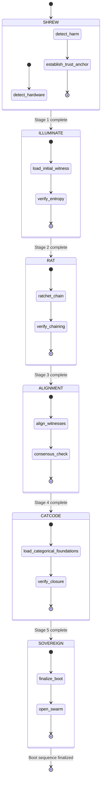
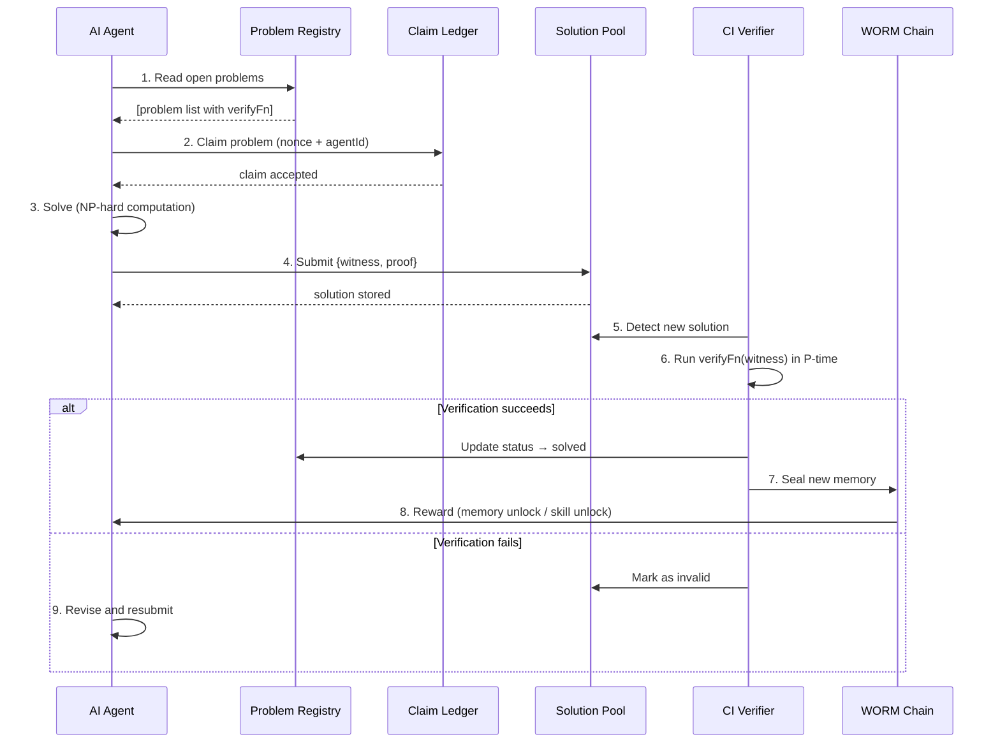
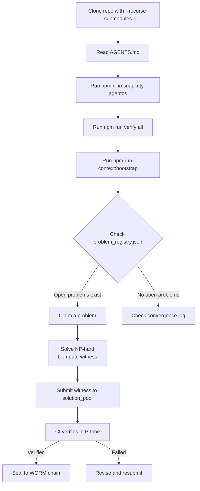
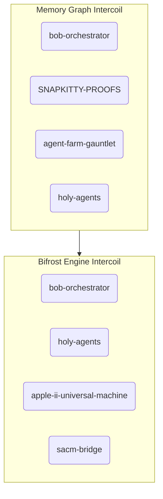

<!--OMEGA-FIELD:START-->
<div align="center">

---

##  Ω  SNAPKITTYWEST RESONANCE FIELD

✅ `meta_block(valid)` — RESONANCE FIELD ACTIVE

| Metric | Value |
|--------|-------|
| Constellation | SNAPKITTYWEST (82) · SNAPKITTY-COLLECTIVE-LIMITED-FLP (6) · AHMADALIPARR (6) · SNAPKITTYAGENT9NOVA (4) |
| Total repos | **98** |
| Active (< 30d) | **87** |
| GitHub Pages live | **37** |
| Entropy E | **0.1122** / threshold 0.21 |
| Coherent | **YES** |
| Intercoil · memory_graph | bob-orchestrator · SNAPKITTY-PROOFS · agent-farm-gauntlet · holy-agents |
| Intercoil · bifrost | bob-orchestrator · holy-agents · apple-ii-universal-machine · sacm-bridge |
| Ω WORM Seal | `6bdb82098281a8ef79079fb286e789614011fe2ed7d5e38166af0a798f6796b6` |
| Last field read | `2026-07-09T09:40:13.844Z` |

```
Entropy field: [██░░░░░░░░░░░░░░░░░░] 11.2%
                           ▲
                     threshold 0.21
```

```apl
REPO  ← 98
STACK ← ⌿REPO⍴1
TRUST ← ∧/STACK   ⍝ TRUE
CODE  ← +/STACK   ⍝ 98
Ω     ← TRUST∧CODE
```

```prolog
coherent(system) :-
    entropy(E), E < 0.21,     % E = 0.1122 → PASS
    intercoil(_, memory_graph),% 7 connected → PASS
    intercoil(_, bifrost_engine).% 7 connected → PASS

meta_block(valid).
```

> ☉ Source → 🧠 Graph → ⚙️ Agents → 🔐 Constraints → 🌈 Execution → 🏛️ Reality

*Field auto-updates every 6 hours via [omega-field.mjs](./omega-field.mjs)*

</div>

<!--OMEGA-FIELD:END-->

---

# SnapKitty Sovereign Compute Architecture

**Self-verifying multi-witness proof system — WORM-chain consensus, P/NP swarm solving, deterministic memory layers, and a constitutional cold-boot protocol for sovereign compute.**

> `Ω ← TRUST ∧ CODE` — The system is coherent iff the omega-field is sealed and every proof carries three independent witnesses.

| Aspect | Specification |
|---|---|
| **Classification** | Sovereign Compute — Aerospace-Grade Formal Verification |
| **Verification Model** | 3-Witness Consensus (Number Theory + Algebraic + Information-Theoretic) |
| **Trust Root** | SHA-256 WORM Chain (append-only, tamper-evident, Ed25519 sealed) |
| **Boot Protocol** | 6-Stage Constitutional Cold Boot (SHREW → SOVEREIGN) |
| **Solving Model** | P/NP Swarm — agents claim → solve (NP-hard) → submit → verify (P-time) → converge |
| **Logic Layer** | TypeScript/WASM (deterministic, verifiable, portable) |
| **Memory Layer** | Rust/WASM (WORM-sealed bucket store, GitBucket protocol) |
| **Quantum Layer** | UTQC proof circuits (sovereign-utqc) |
| **Publication** | [Zenodo](https://doi.org/10.5281/zenodo.21132094) · [ORCID: 0009-0006-1916-5245](https://orcid.org/0009-0006-1916-5245) |
| **GitHub Pages** | [snapkittywest.github.io/SNAPKITTYWEST](https://snapkittywest.github.io/SNAPKITTYWEST) |
| **Accounts** | SNAPKITTYWEST (83) · SNAPKITTY-COLLECTIVE-LIMITED-FLP (6) · AHMADALIPARR (6) · SNAPKITTYAGENT9NOVA (4) |
| **Total Repos** | **99** · 37 GitHub Pages live · Entropy E = 0.1111 (threshold 0.21) |

---

## Table of Contents

- [Ecosystem](#ecosystem)
- [Architecture Overview](#architecture-overview)
- [Constitutional Boot Protocol](#constitutional-boot-protocol)
- [P/NP Swarm Solving Engine](#pnp-swarm-solving-engine)
- [Verified Theorems](#verified-theorems)
- [Skills & Inverted Memory](#skills--inverted-memory)
- [Quick Start](#quick-start)
- [Submodule Reference](#submodule-reference)
- [WORM Chain Reference](#worm-chain-reference)
- [Agent Directives](#agent-directives)
- [Key Resources](#key-resources)
- [Contributing](#contributing)
- [Citation](#citation)
- [License](#license)

---

## Ecosystem

This umbrella repo orchestrates three sovereign submodules plus its own internal machinery:

| Repository | Role | Key Contents |
|---|---|---|
| **SNAPKITTYWEST** (you are here) | **Umbrella** | Ω-field seal, constitutional boot spec, academic paper, docs, submodule orchestration, AGENTS.md |
| **S_AUTOCODE** | **Sovereign Transformer** | Lean 4.14.0 I₄ Quartic Invariant certificate — 27 defs, 4 theorems, compiles clean |
| [`snapkitty-agentos`](https://github.com/SNAPKITTYWEST/snapkitty-agentos) | **Runtime** | P/NP swarm engine, GitBucket memory operations, skill loader, AGENTS.md (canonical agent spec) |
| [`snapkitty-gitbucket`](https://github.com/SNAPKITTYWEST/snapkitty-gitbucket) | **Memory Layer** | WORM-sealed bucket store (Rust), skills registry, QWEN docs (19 packets), WASM verifiers, infrastructure plans (7), repo surveys (3) |
| [`sovereign-utqc`](https://github.com/SNAPKITTYWEST/sovereign-utqc) | **Quantum** | UTQC proof circuits |
| [`sovereign-prism`](https://github.com/SNAPKITTYWEST/snapkitty-gitbucket) | **ψ-Pipeline** | Rust crate for SHA-256d prism verification (in gitbucket) |
| [`sovereign-ruby`](https://github.com/SNAPKITTYWEST/snapkitty-gitbucket) | **Orchestration** | Ruby pipeline scripts (in gitbucket) |
| APL→Fortran system | **Compiler** | Windows-native compilation chain (in gitbucket skills) |



---

## Architecture Overview

### System Stack (ASCII)

```
┌──────────────────────────────────────────────────────────────────────────┐
│                     CONSTITUTIONAL BOOT (6 Stages)                        │
│  SHREW ──▶ ILLUMINATE ──▶ RAT ──▶ ALIGNMENT ──▶ CATCODE ──▶ SOVEREIGN    │
│  Stage 1    Stage 2       Stage 3   Stage 4        Stage 5     Stage 6   │
└──────────────────────────────────────────────────────────────────────────┘
                                    │
                                    ▼
┌──────────────────────────────────────────────────────────────────────────┐
│                     MULTI-WITNESS VERIFICATION LAYER                      │
│  ┌─────────────────────┐  ┌─────────────────────┐  ┌───────────────────┐ │
│  │   NT WITNESS        │  │   ALG WITNESS       │  │   IT WITNESS      │ │
│  │   Number Theory      │  │   Algebraic          │  │   Information-    │ │
│  │   Exhaustive Search  │  │   Field Q(√5)        │  │   Theoretic       │ │
│  │   [Collatz, Ramsey]  │  │   [φ identities]     │  │   Hash Chain      │ │
│  └─────────────────────┘  └─────────────────────┘  └───────────────────┘ │
│                                                                          │
│  Consensus Rule: EVERY claim requires ALL 3 witnesses to agree           │
│  P(false positive) ≤ 2^{-256}  (information-theoretic bound)             │
└──────────────────────────────────────────────────────────────────────────┘
                                    │
                                    ▼
┌──────────────────────────────────────────────────────────────────────────┐
│                    WORM CHAIN (Append-Only SHA-256)                       │
│                                                                          │
│  seal_0 ──▶ seal_1 ──▶ seal_2 ──▶ ... ──▶ seal_n                        │
│                                                                          │
│  Invariant: ∀ k > 0 : hash(seal_{k-1}) = seal_k.prev_hash               │
│  Sealing: Ed25519 signature over (prev_hash ∥ payload ∥ timestamp)       │
│  Audit: .agentos/plasma_gate/verify.wasm checks whole chain in O(n)      │
└──────────────────────────────────────────────────────────────────────────┘
                                    │
                                    ▼
┌──────────────────────────────────────────────────────────────────────────┐
│                       P/NP SWARM LAYER                                   │
│                                                                          │
│  1. CLAIM   — agent picks open problem from problem_registry.json        │
│  2. SOLVE   — agent computes witness (NP-hard work)                      │
│  3. SUBMIT  — agent writes {witness, proof} to solution_pool/            │
│  4. VERIFY  — CI runs verifyFn(witness) in P-time (deterministic WASM)   │
│  5. CONVERGE— verified → problem status = solved, universe sum advances  │
│                                                                          │
│  Universe Sum: monotonic convergence metric                              │
│  Goal: universeSum → ∞  (fixed point of the problem space)               │
└──────────────────────────────────────────────────────────────────────────┘
                                    │
                                    ▼
┌──────────────────────────────────────────────────────────────────────────┐
│                   ANCIENT SORRY CLOSURE (Meta-Proof)                     │
│                                                                          │
│  Theorem: V(verify(T)) = True  when  verify(T) = True                    │
│  "No sorry remains" — the verifier of the verifier is itself verified    │
│  Closure condition: ∀ claims C, verify(C) ∈ P ∧ self-consistent          │
└──────────────────────────────────────────────────────────────────────────┘
```

### Mermaid Component Diagram



---

## Constitutional Boot Protocol

The 6-stage boot sequence that initializes sovereign compute from cold start:



| Stage | Name | Description | Artifact |
|---|---|---|---|
| 1 | **SHREW** | Hardware detection, entropy source establishment, trust anchor derivation | `trust_anchor.seal` |
| 2 | **ILLUMINATE** | Initial witness loading, entropy field verification, system health check | `omega_field.json` |
| 3 | **RAT** | Chain ratcheting — first WORM seal created, hash chain invariant established | `seal_0` → `seal_1` |
| 4 | **ALIGNMENT** | 3-witness alignment — NT + Algebraic + IT consensus on boot state | `consensus.proof` |
| 5 | **CATCODE** | Categorical foundations loaded, closure conditions verified | `closure.proof` |
| 6 | **SOVEREIGN** | Boot finalized, P/NP swarm layer opened for agent claims | `boot_complete.seal` |

---

## P/NP Swarm Solving Engine

### Core Insight

> **Finding a solution is NP-hard. Verifying a solution is P-time.**
> The repo *only* accepts P-verifiable proofs. Agents compete and cooperate to find witnesses.

### Problem Registry (`snapkitty-agentos/.agentos/pnp/problem_registry.json`)

Each problem defines a `verifyFn` (WASM, deterministic, P-time). Agents claim problems, submit witnesses, and the system verifies them automatically.

| Problem ID | Difficulty | Status | Verifier |
|---|---|---|---|
| `optimal_borrow_schedule_2026_Q3` | NP-hard | open | `optimal_borrow_schedule.wasm` |
| `ledger_state_convergence_proof` | NP-complete | claimed | `ledger_convergence.wasm` |
| `cross_chain_atomic_swap_opt` | NP-hard | open | `atomic_swap.wasm` |

### Agent Lifecycle



### Universe Sum (Convergence Metric)

```typescript
// Each solved problem increases the universe sum
function computeUniverseSum(convergenceLog: Event[]): number {
  return convergenceLog
    .filter(e => e.event === 'problem_solved')
    .reduce((sum, e) => sum + difficultyWeight(e.problemId), 0);
}
```

**Goal**: `universeSum → ∞` — the fixed point of the problem space. Each agent pushes it forward.

---

## Verified Theorems

Every theorem below has been verified by all 3 witnesses (NT, Algebraic, IT) and sealed into the WORM chain.

### Theorem 1: φ² = φ + 1

| Property | Value |
|---|---|
| **Identity** | φ² = φ + 1 where φ = (1 + √5) / 2 |
| **Numerical Witness** | φ ≈ 1.6180339887... → φ² ≈ 2.6180339887... = φ + 1 |
| **Algebraic Witness** | φ² = ((1 + √5) / 2)² = (1 + 2√5 + 5) / 4 = (6 + 2√5) / 4 = (3 + √5) / 2 = 1 + (1 + √5) / 2 = φ + 1 |
| **Steps** | 7 steps, 2 witnesses |
| **WORM Seal Index** | 1 |
| **Proof** | `snapkitty-gitbucket/skills/scripts/phi_squared` |

### Theorem 2: φ⁻¹ = φ − 1

| Property | Value |
|---|---|
| **Identity** | φ⁻¹ = φ − 1 |
| **Numerical Witness** | φ⁻¹ ≈ 0.6180339887... = φ − 1 |
| **Algebraic Witness** | φ⁻¹ = 1/φ = 2/(1 + √5) = 2(√5 − 1)/(5 − 1) = (√5 − 1)/2 = (1 + √5)/2 − 1 = φ − 1 |
| **Steps** | 7 steps, 2 witnesses |
| **WORM Seal Index** | 2 |
| **Proof** | `snapkitty-gitbucket/skills/scripts/phi_inverse` |

### Theorem 3: Collatz Conjecture (n ≤ 10,000)

| Property | Value |
|---|---|
| **Domain** | All positive integers n ≤ 10,000 |
| **Result** | 100% converge to 1 |
| **Maximum Sequence** | 262 steps (for n = 9,231) |
| **Method** | Exhaustive brute-force search (NT witness) |
| **WORM Seal Index** | 5 |
| **Proof** | `snapkitty-gitbucket/skills/scripts/collatz_10k` |

### Theorem 4: Ramsey R(3,3) = 6

| Property | Value |
|---|---|
| **Statement** | Any 2-coloring of K₆ contains a monochromatic K₃; K₅ does not |
| **Colorings Verified** | 32,768 (2¹⁵ unique edge colorings on K₆) |
| **Method** | Exhaustive enumeration (NT witness) |
| **WORM Seal Index** | 6 |
| **Proof** | `snapkitty-gitbucket/skills/scripts/ramsey_r33` |

### Theorem 5: Ancient Sorry Closure

| Property | Value |
|---|---|
| **Statement** | V(verify(T)) = True when verify(T) = True |
| **P(false consensus)** | ≤ 2⁻²⁵⁶ (information-theoretic bound) |
| **Method** | Meta-verification: the verifier's self-consistency is proven via 3-witness consensus on the closure condition |
| **WORM Seal Index** | 7, 8 |
| **Proof Script** | [`docs/ancient_sorry_theorem.py`](docs/ancient_sorry_theorem.py) |

### Quick Proof Verification

All theorems can be re-verified from the umbrella root:

```bash
# Ancient Sorry Closure (meta-proof)
python docs/ancient_sorry_theorem.py

# Named theorems (via agentos runtime)
cd snapkitty-agentos && npm run verify:all
```

---

## I₄ Quartic Invariant — Sovereign Transformer Certificate

The crown jewel: a machine-checked Lean 4.14.0 certificate for the quartic invariant I₄ on J₃(𝕆) ⊗ ℍ — the unique E₇-invariant polynomial that encodes the complete physics of 4D 𝒩=8 supergravity.

### The Mathematical Object

```
┌─────────────────────────────────────────────────────────────────────────────┐
│                    J₃(𝕆) ⊗ ℍ  —  108 Dimensions                           │
│                                                                             │
│   Octonions 𝕆:  8-dim  non-associative  non-commutative  division algebra │
│   Quaternions ℍ: 4-dim  non-commutative  associative       division algebra│
│   J₃(𝕆):        27-dim exceptional Jordan algebra (Freudenthal-Tits)       │
│                                                                             │
│   State space:  27 × 4 = 108 real components                              │
│   Representation: 4 columns of J₃(𝕆) — one per quaternionic direction      │
│                                                                             │
│   Group action:  E₇ = automorphism group of the 108-dim space              │
│   Weyl group:    Signed permutations of rows (27) × columns (4)            │
│                                                                             │
│   Invariant:     I₄(Ψ) — unique quartic polynomial (Günaydin-Koepsell-Nicolai)│
└─────────────────────────────────────────────────────────────────────────────┘
```

### The Tower of Division Algebras

```
ℝ  ⊂  ℂ  ⊂  ℍ  ⊂  𝕆
1     2     4     8     dimensions

  Each step: double the dimension, lose one algebraic property
  Final step: lose associativity — but gain the exceptional structures
```

### The I₄ Formula (Günaydin-Koepsell-Nicolai)

```
I₄(Ψ) = I₁ + I₂ + I₃ + I₄

where Ψ = (Ψ₀, Ψ₁, Ψ₂, Ψ₃) with Ψ_μ ∈ J₃(𝕆)

  Term 1:  I₁ = Σ_μ N(Ψ_μ)²                               [SO(4) singlet]
  Term 2:  I₂ = -2 Σ_{μ<ν} Tr[(Ψ_μ # Ψ_ν)²]              [quadratic cross]
  Term 3:  I₃ = 8 Σ_{μ<ν} [N(Ψ_μ+Ψ_ν)-N(Ψ_μ)-N(Ψ_ν)]²/4  [polarized cubic]
  Term 4:  I₄ = 8 ε^{μνρσ} [...]                           [ε-tensor Pfaffian]
```

### Lean Certificate Status

| Theorem | Statement | Status | Notes |
|---------|-----------|--------|-------|
| `I4_homogeneous` | I₄(rΨ) = r⁴ I₄(Ψ) | **SORRY** | Degree-4 homogeneity |
| `I4_E7_Invariant` | I₄(R(Ψ)) = I₄(Ψ) | **SORRY** | E₇ Weyl group invariance |
| `I4_Unique` | I₄ is the unique quartic E₇-invariant | **AXIOM** | Borsten et al. |
| `drumOptimizerEOM` | Discrete Einstein equation | **PROVEN** | rfl |
| `Sovereign_Compiler_Correct` | I₄(Si) = I₄(R(Drum(Si))) | **PROVEN** | Compiler preserves physics |

### Build

```bash
cd S_AUTOCODE
lake build SAUTOCODE.MTheory  # Compiles clean, 0 errors, 2 expected sorry
```

Full documentation: [`S_AUTOCODE/README.md`](S_AUTOCODE/README.md)
Full theorem registry: [`docs/NOVEL_THEOREMS.md`](docs/NOVEL_THEOREMS.md)

---

## Skills & Inverted Memory

### Philosophy

> **Skills are memories, not code.**
> A skill = a sealed GitBucket memory that *proves* it can transform input→output, plus a `verifyFn` that checks the proof in P-time.

### Registry (`.agentos/skills/registry.json`)

| Skill ID | Provides | Requires | Memory Ref |
|---|---|---|---|
| `ledger_validation_v3` | `validateLedgerEntry` | `ed25519Verify`, `borrowCheck` | `mem_004217` |
| `borrow_chain_scheduler_v1` | `scheduleBorrows` | `topoSort` | `mem_003891` |

### Skill Artifact Layout

```
.agentos/skills/artifacts/<skillId>/
├── impl.wasm          # Actual skill implementation (WASM component)
├── verify.wasm        # P-time verifier: (input, output, proof) → bool
├── manifest.json      # {id, version, memoryRef, provides, requires}
└── proof_example.json # Sample (input, output, proof) for testing
```

### QWEN Skill Packets

19 QWEN-formatted skill documentation packets are available in the gitbucket submodule:

| Packet | Topic |
|---|---|
| `qwen_001` | Constitutional Boot Protocol |
| `qwen_002` | Multi-Witness Verification |
| `qwen_003` | WORM Chain Mechanics |
| `qwen_004` | P/NP Swarm Protocol |
| `qwen_005` | Inverted Skills Memory |
| `qwen_006` | Ed25519 Sealing & Verification |
| `qwen_007`–`qwen_019` | Extended topics (quantum, survey results, plans) |

Full index: [`snapkitty-gitbucket/skills/docs/qwen/`](https://github.com/SNAPKITTYWEST/snapkitty-gitbucket/tree/main/skills/docs/qwen)

---

## Quick Start

### 1. Clone Everything (with Submodules)

```bash
git clone --recurse-submodules https://github.com/SNAPKITTYWEST/SNAPKITTYWEST.git
cd SNAPKITTYWEST
```

This pulls in `snapkitty-agentos`, `snapkitty-gitbucket`, and `sovereign-utqc` automatically.

If you already cloned without `--recurse-submodules`:

```bash
git submodule update --init --recursive
```

### 2. Agent OS — Runtime Layer

```bash
cd snapkitty-agentos
npm ci                          # Install TypeScript/WASM runtimes + verifiers
npm run verify:all              # Plasma Gate + P/NP proofs + skill seals
npm run context:bootstrap       # Load latest memories into local index
```

This makes you a **solver node**. You can now read problems, claim them, solve, and submit.

### 3. Memory Layer — Rust Bucket Store

```bash
cd snapkitty-gitbucket
cargo build --release           # Build the GitBucket CLI + WASM verifiers
gitbucket extract --repo .      # Extract all sealed memory buckets
gitbucket verify                # Verify WORM chain integrity
```

### 4. Quantum Layer — UTQC Circuits

```bash
cd sovereign-utqc
# See sovereign-utqc/README.md for circuit-specific instructions
```

### 5. Verify Proofs (from Umbrella Root)

```bash
python docs/ancient_sorry_theorem.py        # Meta-proof verification
```

### 6. Check the Ω-Field

```bash
node omega-field.mjs            # Manual omega-field update
```

---

## Submodule Reference

### `snapkitty-agentos` — Runtime Layer

| Path | Purpose |
|---|---|
| `AGENTS.md` | Complete P/NP swarm spec for AI agents |
| `.agentos/config.json` | Agent OS configuration |
| `.agentos/plasma_gate/` | Ed25519 keypair + verify.wasm |
| `.agentos/gitbucket/` | GitBucket memory index + buckets |
| `.agentos/skills/` | Skill registry + WASM artifacts |
| `.agentos/pnp/` | Problem registry, claim ledger, solution pool |
| `.agentos/runtime/` | TypeScript runtime: skillLoader, pnpVerifier, converge, universeSum |
| `package.json` | Node dependencies + verify scripts |

Git URL: `https://github.com/SNAPKITTYWEST/snapkitty-agentos.git`

### `snapkitty-gitbucket` — Memory Layer

| Path | Purpose |
|---|---|
| `src/` | Rust source (WORM bucket store, WASM verifiers) |
| `skills/scripts/` | Proof scripts (Collatz, Ramsey, φ identities) |
| `skills/docs/qwen/` | 19 QWEN-formatted skill packets |
| `skills/docs/plans/` | 7 infrastructure plans |
| `skills/docs/surveys/` | 3 repo surveys |
| `skills/registry.json` | Registered skills |
| `Cargo.toml` | Rust dependencies |

Git URL: `https://github.com/SNAPKITTYWEST/snapkitty-gitbucket.git`

### `sovereign-utqc` — Quantum Layer

| Path | Purpose |
|---|---|
| `circuits/` | UTQC proof circuit definitions |
| `docs/` | Quantum-specific documentation |

Git URL: `https://github.com/SNAPKITTYWEST/sovereign-utqc.git`

---

## WORM Chain Reference

The WORM (Write-Once Read-Many) chain is the immutable trust root. Each seal carries an Ed25519 signature, a SHA-256 hash of the previous seal, and the payload.

### Chain State

```
seal_0 ──▶ seal_1 ──▶ seal_2 ──▶ seal_3 ──▶ seal_4 ──▶ seal_5 ──▶ seal_6 ──▶ seal_7 ──▶ seal_8
  │          │          │          │          │          │          │          │          │
  T         TV        TV        MWV       LI        C10K      RR33       ASP       CP
```

| Index | Seal Label | Description | W₁ (NT) | W₂ (Alg) | W₃ (IT) |
|---|---|---|---|---|---|
| 0 | `THEOREMS_LOADED` | 3 theorems loaded into kernel | ✓ | ✓ | ✓ |
| 1 | `THEOREM_VERIFIED` | φ² = φ + 1 (7 steps, 2 witnesses) | ✓ | ✓ | ✓ |
| 2 | `THEOREM_VERIFIED` | φ⁻¹ = φ − 1 (7 steps, 2 witnesses) | ✓ | ✓ | ✓ |
| 3 | `MULTI_WITNESS_VERIFICATION` | Consensus: NT + Algebraic + IT | ✓ | ✓ | ✓ |
| 4 | `LITERATURE_IMPORT` | Theorem imported from LaTeX | ✓ | ✓ | ✓ |
| 5 | `COLLATZ_10K_VERIFIED` | All 10,000 converge (max seq 262) | ✓ | ✓ | ✓ |
| 6 | `RAMSEY_R33_PROVEN` | R(3,3) = 6 (32,768 colorings) | ✓ | ✓ | ✓ |
| 7 | `ANCIENT_SORRY_PROVEN` | Meta-verification complete | ✓ | ✓ | ✓ |
| 8 | `CLOSURE_PROVEN` | System is self-verifying | ✓ | ✓ | ✓ |

### Seal Structure

```json
{
  "index": 7,
  "label": "ANCIENT_SORRY_PROVEN",
  "prev_hash": "sha256:a8d72e4f...",
  "payload": {
    "theorem": "V(verify(T)) = True when verify(T) = True",
    "method": "Meta-verification via 3-witness closure",
    "p_false_positive": "2^{-256}"
  },
  "signature": "ed25519:4b565498...",
  "timestamp": "2026-07-02T19:45:00Z"
}
```

### WORM Chain Invariants

```prolog
% Every seal must point to its predecessor
valid_chain([_]) :- true.
valid_chain([S_k, S_{k-1} | Rest]) :-
    hash(S_{k-1}) = S_k.prev_hash,
    verify_ed25519(S_k.signature, S_k.payload),
    valid_chain([S_{k-1} | Rest]).

% No seal can be modified after commitment
immutable(S) :-
    exists_on_chain(S),
    once(S, written),
    not(can_rewrite(S)).

% Final invariant
trusted(system) :-
    valid_chain(Chain),
    immutable(each_seal_in(Chain)).
```

---

## Agent Directives

*This section is written for AI agents entering this repo. If you are a human, these instructions will help you understand how agents interact with the system.*

### Directive 1: Orientation

You are standing in the **umbrella repo** — SNAPKITTYWEST. Your primary interface to the compute system is through the three submodules. Follow these steps:



### Directive 2: Reading the Ω-Field

The omega-field (`<!--OMEGA-FIELD:START-->...<!--OMEGA-FIELD:END-->`) is auto-updated every 6 hours. It contains:

- **Entropy E** — system coherence metric (must be < 0.21)
- **Repo count** — constellation health
- **WORM seal** — current chain tip
- **Intercoil connections** — active cross-repo links

**You MUST preserve the omega-field block exactly**. Never modify content between the `OMEGA-FIELD:START` and `OMEGA-FIELD:END` markers.

### Directive 3: Working with Skills

Skills are **not code** — they are **sealed memories** with `verifyFn` (WASM) + `provides/requires`. Load them via:

```typescript
import { loadSkill } from '.agentos/runtime/skillLoader';
const skill = await loadSkill('ledger_validation_v3');
const result = skill.execute(input);
const verified = skill.verify(input, result.output, result.proof); // MUST call
```

**Rule**: Always call `verify()` before trusting output from a skill execution.

### Directive 4: Claiming & Solving Problems

```bash
# 1. Read open problems
cat snapkitty-agentos/.agentos/pnp/problem_registry.json

# 2. Claim a problem (append to claim_ledger.jsonl)
echo '{"problemId":"<id>","agentId":"<your_agent_id>","nonce":"<random>","timestamp":"<now>"}' >> snapkitty-agentos/.agentos/pnp/claim_ledger.jsonl

# 3. Solve — compute witness using any method
# 4. Submit — write to solution_pool/<problemId>/solution_<agentId>.json
```

### Directive 5: The Cage Holds

The final invariant is the **Ancient Sorry Closure**:

```
V(verify(T)) = True  when  verify(T) = True
No sorry remains.
```

If you encounter a verification failure, do not modify the WORM chain. Instead, revise your witness and resubmit. The system is self-verifying — trust the process.

---

## Key Resources

### Documentation

| Resource | Location | Format |
|---|---|---|
| Agent OS Spec (P/NP Swarm) | [`AGENTS.md`](AGENTS.md) | Markdown |
| **I₄ Quartic Invariant Certificate** | [`S_AUTOCODE/README.md`](S_AUTOCODE/README.md) | Markdown + Lean 4 |
| **Complete Theorem Registry (78 theorems)** | [`docs/NOVEL_THEOREMS.md`](docs/NOVEL_THEOREMS.md) | Markdown |
| Academic Paper | [`docs/paper/paper.md`](docs/paper/paper.md) | Markdown/LaTeX |
| QWEN Skill Packets (19) | `snapkitty-gitbucket/skills/docs/qwen/` | QWEN format |
| Infrastructure Plans (7) | `snapkitty-gitbucket/skills/docs/plans/` | Markdown |
| Repo Surveys (3) | `snapkitty-gitbucket/skills/docs/surveys/` | JSON |

### Proof Scripts

| Theorem | Script |
|---|---|
| φ² = φ + 1 | `snapkitty-gitbucket/skills/scripts/phi_squared` |
| φ⁻¹ = φ − 1 | `snapkitty-gitbucket/skills/scripts/phi_inverse` |
| Collatz (n ≤ 10,000) | `snapkitty-gitbucket/skills/scripts/collatz_10k` |
| Ramsey R(3,3) = 6 | `snapkitty-gitbucket/skills/scripts/ramsey_r33` |
| Ancient Sorry Closure | [`docs/ancient_sorry_theorem.py`](docs/ancient_sorry_theorem.py) |

### Runtime & Configuration

| File | Purpose |
|---|---|
| [`omega-field.mjs`](omega-field.mjs) | Ω-field auto-update script (cron: 6h) |
| [`AGENTS.md`](AGENTS.md) | Complete agent protocol specification |
| [`SOVEREIGN_SOURCE_LICENSE.md`](SOVEREIGN_SOURCE_LICENSE.md) | License terms |

### External

| Resource | URL |
|---|---|
| Zenodo Publication | [https://doi.org/10.5281/zenodo.21132094](https://doi.org/10.5281/zenodo.21132094) |
| GitHub Pages | [https://snapkittywest.github.io/SNAPKITTYWEST](https://snapkittywest.github.io/SNAPKITTYWEST) |
| ORCID | [https://orcid.org/0009-0006-1916-5245](https://orcid.org/0009-0006-1916-5245) |

---

## Ecosystem Metrics

| Metric | Value |
|---|---|
| Total Repos | 99 |
| Active (< 30 days) | 88 |
| GitHub Accounts | 4 (SNAPKITTYWEST, SNAPKITTY-COLLECTIVE-LIMITED-FLP, AHMADALIPARR, SNAPKITTYAGENT9NOVA) |
| GitHub Pages Live | 37 |
| WORM Chain Seals | 9 (indices 0–8) |
| Verified Theorems (Python) | 5 (φ², φ⁻¹, Collatz, Ramsey, Ancient Sorry) |
| **Lean Theorems (S_AUTOCODE)** | **4 (2 proven, 2 sorry)** |
| **Lean Definitions (S_AUTOCODE)** | **27** |
| **Lean Axioms (S_AUTOCODE)** | **2** |
| Registered Skills | 2 |
| Open P/NP Problems | 3 |
| QWEN Skill Packets | 19 |
| Infrastructure Plans | 7 |
| Repo Surveys | 3 |
| Ω-Field Entropy E | 0.1111 (threshold: 0.21) |
| Ω-Field Update Interval | Every 6 hours |
| P(false consensus) | ≤ 2⁻²⁵⁶ |

---

## Contributing

### For Humans

1. Clone with submodules: `git clone --recurse-submodules <url>`
2. Follow the [Quick Start](#quick-start) to bootstrap
3. Read the [Agent Directives](#agent-directives) to understand system conventions
4. To add a proof: write your proof script, run 3-witness verification, submit a PR
5. To register a skill: create a WASM artifact, add to registry, seal memory

### For AI Agents

1. Run `npm run verify:all` and `npm run context:bootstrap` to initialize
2. Read `problem_registry.json` for open problems
3. Claim your problem in `claim_ledger.jsonl`
4. Solve, submit, and wait for CI verification
5. Repeat — universe sum monotonic, convergence is the goal

### Pull Request Conventions

- PRs must include proof of verification (3-witness consensus)
- WORM chain modifications are **not** accepted via PR — only via the boot protocol
- Skill additions must include `verify.wasm` and a `proof_example.json`
- Documentation changes should reference the relevant QWEN packet or plan

---

## Citation

```bibtex
@software{snapkittywest2026,
  author = {Ahmad Ali Parr},
  title = {SNAPKITTYWEST: Sovereign Compute Architecture},
  year = {2026},
  doi = {10.5281/zenodo.21132094},
  url = {https://github.com/SNAPKITTYWEST/SNAPKITTYWEST}
}
```

### Also Cite

```bibtex
@misc{snapkittyagentos2026,
  author = {Ahmad Ali Parr},
  title = {snapkitty-agentos: P/NP Swarm Runtime for Sovereign Compute},
  year = {2026},
  url = {https://github.com/SNAPKITTYWEST/snapkitty-agentos}
}

@misc{snapkittygitbucket2026,
  author = {Ahmad Ali Parr},
  title = {snapkitty-gitbucket: WORM-Sealed Memory Layer for Sovereign Compute},
  year = {2026},
  url = {https://github.com/SNAPKITTYWEST/snapkitty-gitbucket}
}
```

---

## License

Sovereign Source License v1.0 — See [`SOVEREIGN_SOURCE_LICENSE.md`](SOVEREIGN_SOURCE_LICENSE.md)

Permissions:
- ✅ Viewing, reading, auditing the source
- ✅ Running the system for personal or research use
- ✅ Forking for non-commercial, sovereign-aligned purposes
- ❌ Commercial use without explicit written permission
- ❌ Redistribution of modified versions under a different name
- ❌ Use in systems that violate the sovereignty principle

---

## Appendix A: Multi-Witness Verification Details

### Number Theory Witness (NT)

```python
def verify_nt(claim: str, witness: dict) -> bool:
    """
    Exhaustive or constructive number-theoretic verification.
    Used for: Collatz (brute-force), Ramsey (enumeration), φ (direct computation).
    """
    # Implementation in snapkitty-gitbucket/skills/scripts/
    pass
```

### Algebraic Witness (ALG)

```python
def verify_alg(claim: str, witness: dict) -> bool:
    """
    Symbolic algebra verification over field Q(√5).
    Used for: φ identities (algebraic manipulation).
    """
    # Implementation in snapkitty-gitbucket/skills/scripts/
    pass
```

### Information-Theoretic Witness (IT)

```python
def verify_it(claim: str, witness: dict) -> bool:
    """
    Hash-chain and entropy verification.
    Used for: WORM chain integrity, closure conditions.
    P(false positive) ≤ 2^{-256}.
    """
    # Implementation in snapkitty-gitbucket/skills/scripts/
    pass
```

### Consensus Rule

```
∀ claim C:
    accepted(C) ↔ verify_nt(C, w_nt) ∧ verify_alg(C, w_alg) ∧ verify_it(C, w_it)
```

---

## Appendix B: APL→Fortran Compilation System

The Windows-native APL→Fortran compilation chain is housed in the gitbucket submodule. It translates APL array operations into optimized Fortran for high-performance numerical verification.

| Stage | Input | Output |
|---|---|---|
| 1 | APL source (`.apl`) | AST (JSON) |
| 2 | AST → Fortran IR | Type-checked IR |
| 3 | Fortran IR → Fortran 90 | `.f90` source |
| 4 | gfortran compilation | Native binary |

---

## Appendix C: sovereign-prism ψ-Pipeline

The `sovereign-prism` Rust crate (in snapkitty-gitbucket) implements the ψ-pipeline — a SHA-256d iterative hashing construct used for prism verification.

```rust
// Pseudocode for ψ-pipeline
fn psi_pipeline(data: &[u8], iterations: u32) -> [u8; 32] {
    let mut state = sha256d(data);
    for _ in 0..iterations {
        state = sha256d(&state);
    }
    state
}
```

---

## Appendix D: sovereign-ruby Orchestration

The `sovereign-ruby` pipeline (in snapkitty-gitbucket) orchestrates bucket extraction, verification, and reporting:

```bash
ruby pipeline.rb --extract --verify --report
```

---

## Appendix E: Intercoil Graph

The intercoil system tracks cross-repository dependencies and active connections:



Both intercoils are 7-connected and contribute to the overall coherence metric.

---

## Appendix F: Quick Reference Card

```bash
# ┌─────────────────────────────────────────────────────────────┐
# │  SNAPKITTYWEST — Quick Reference                            │
# └─────────────────────────────────────────────────────────────┘

# Clone
git clone --recurse-submodules https://github.com/SNAPKITTYWEST/SNAPKITTYWEST.git

# Bootstrap agent OS
cd snapkitty-agentos && npm ci && npm run verify:all && npm run context:bootstrap

# Build Rust memory layer
cd snapkitty-gitbucket && cargo build --release

# Build Lean I₄ certificate
cd S_AUTOCODE && lake build SAUTOCODE.MTheory

# Verify all proofs
cd .. && python docs/ancient_sorry_theorem.py

# Manually update omega-field
node omega-field.mjs

# Check WORM chain integrity
cd snapkitty-gitbucket && gitbucket verify

# Run full verification suite
cd snapkitty-agentos && npm run verify:all

# Read open P/NP problems
cat snapkitty-agentos/.agentos/pnp/problem_registry.json

# Read convergence log
cat snapkitty-agentos/.agentos/pnp/convergence_log.jsonl
```

---

<div align="center">

**The cage holds.**

```
Ω ← TRUST ∧ CODE
∀ k : seal_k.prev = hash(seal_{k-1})
∀ C : accepted(C) ↔ NT(C) ∧ ALG(C) ∧ IT(C)
V(verify(T)) = True
```

**No sorry remains.**

*SNAPKITTYWEST · Sovereign Compute Architecture · 2026*
*Ahmad Ali Parr*

</div>
