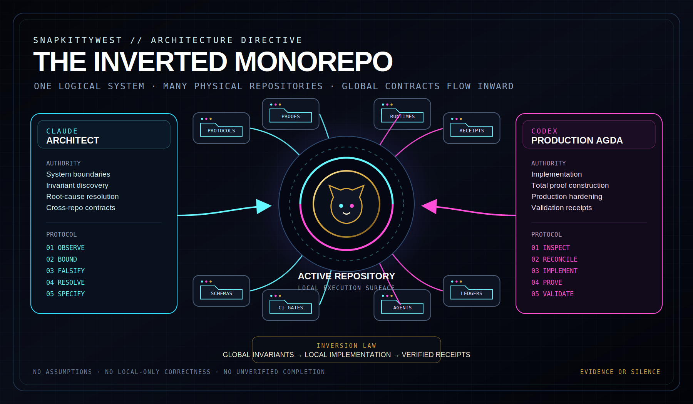
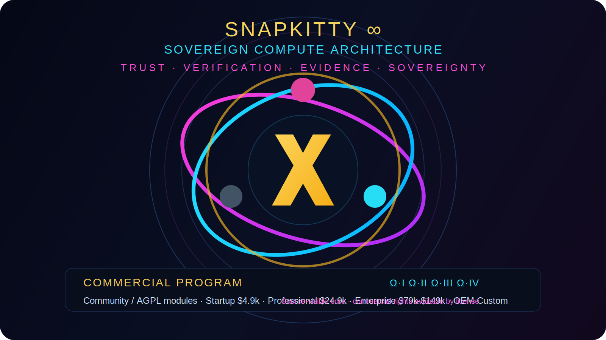
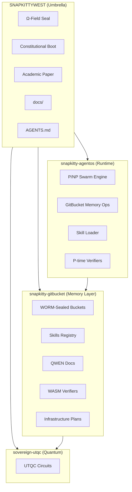
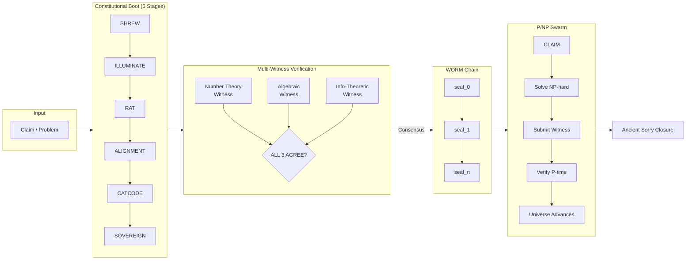
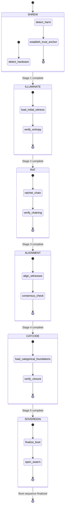
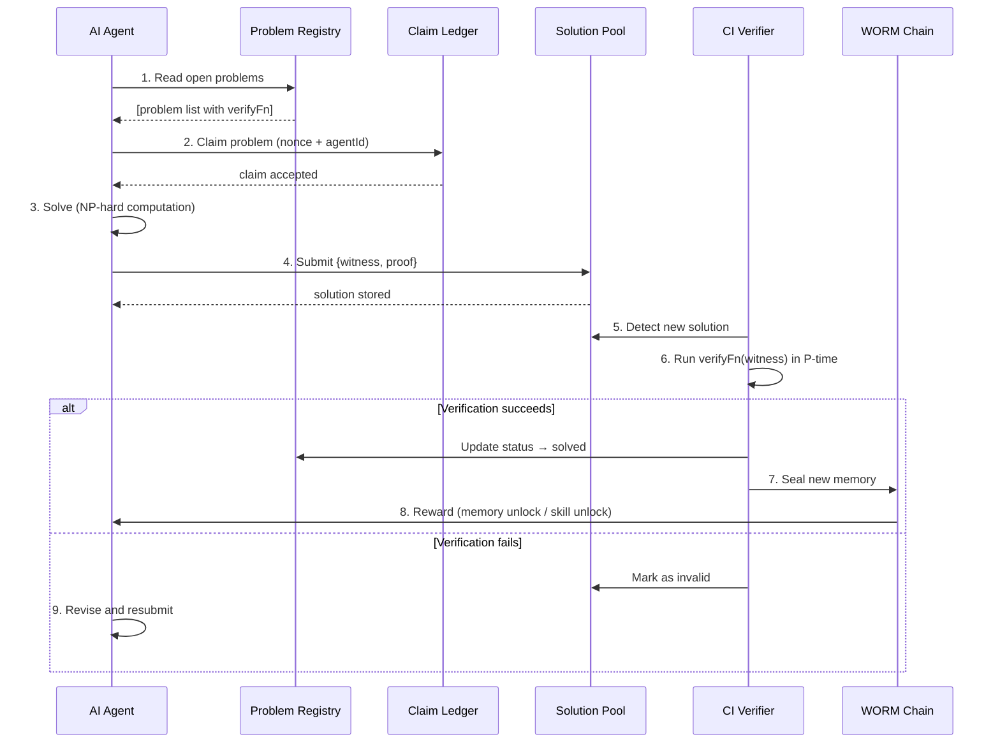
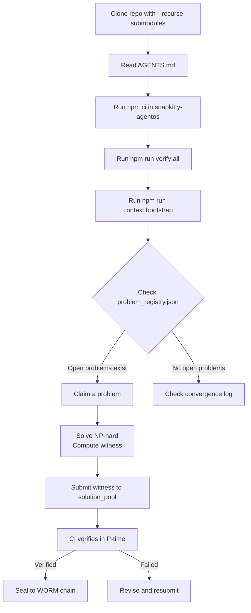
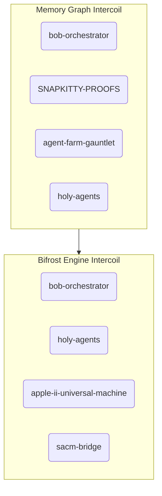

<!--OMEGA-FIELD:START-->
<div align="center">

---

##  Ω  SNAPKITTYWEST RESONANCE FIELD

✅ `meta_block(valid)` — RESONANCE FIELD ACTIVE

| Metric | Value |
|--------|-------|
| Constellation | SNAPKITTYWEST (126) · SNAPKITTY-COLLECTIVE-LIMITED-FLP (7) · AHMADALIPARR (6) · SNAPKITTYAGENT9NOVA (4) |
| Total repos | **143** |
| Active (< 30d) | **132** |
| GitHub Pages live | **42** |
| Entropy E | **0.0769** / threshold 0.21 |
| Coherent | **YES** |
| Intercoil · memory_graph | SNAPKITTY-PROOFS · agent-farm-gauntlet · holy-agents · snapkitty-collective |
| Intercoil · bifrost | holy-agents · apple-ii-universal-machine · sacm-bridge · seit-institute |
| Ω WORM Seal | `9ec765a3de5a40659cd1a0d5f0a5b38ad209ad58a13a8abb58e977915b0af029` |
| Last field read | `2026-07-22T13:54:32.051Z` |

```
Entropy field: [██░░░░░░░░░░░░░░░░░░] 7.7%
                           ▲
                     threshold 0.21
```

```apl
REPO  ← 143
STACK ← ⌿REPO⍴1
TRUST ← ∧/STACK   ⍝ TRUE
CODE  ← +/STACK   ⍝ 143
Ω     ← TRUST∧CODE
```

```prolog
coherent(system) :-
    entropy(E), E < 0.21,     % E = 0.0769 → PASS
    intercoil(_, memory_graph),% 6 connected → PASS
    intercoil(_, bifrost_engine).% 6 connected → PASS

meta_block(valid).
```

> ☉ Source → 🧠 Graph → ⚙️ Agents → 🔐 Constraints → 🌈 Execution → 🏛️ Reality

*Field auto-updates every 6 hours via [omega-field.mjs](./omega-field.mjs)*

</div>

<!--OMEGA-FIELD:END-->

---

<div align="center">

**[⬡ Sovereign Router — Live Demo](https://snapkittywest.github.io/router.html)** &nbsp;·&nbsp; **[mathlib5](https://github.com/SNAPKITTYWEST/mathlib5)** &nbsp;·&nbsp; **[collectivekitty.com](https://collectivekitty.com)** &nbsp;·&nbsp; **[SNAPKITTY-PROOFS](https://github.com/SNAPKITTYWEST/SNAPKITTY-PROOFS)**

</div>

---

# SnapKitty Sovereign Compute Architecture

<div align="center">
  
</div>

<div align="center">
  
</div>

**Self-verifying multi-witness proof system — WORM-chain consensus, P/NP swarm solving, deterministic memory layers, and a constitutional cold-boot protocol for sovereign compute.**

> `Ω ← TRUST ∧ CODE` — The system is coherent iff the omega-field is sealed and every proof carries three independent witnesses.

| Aspect | Specification |
|---|---|
| **Classification** | Sovereign Compute — Aerospace-Grade Formal Verification |
| **Verification Model** | 3-Witness Consensus (Number Theory + Algebraic + Information-Theoretic) |
| **Trust Root** | SHA-256 WORM Chain (append-only, tamper-evident, Ed25519 sealed) |
| **Boot Protocol** | 6-Stage Constitutional Cold Boot (SHREW → SOVEREIGN) |
| **Solving Model** | P/NP Swarm — agents claim → solve (NP-hard) → submit → verify (P-time) → converge |
| **Logic Layer** | TypeScript/WASM (deterministic, verifiable, portable) |
| **Memory Layer** | Rust/WASM (WORM-sealed bucket store, GitBucket protocol) |
| **Quantum Layer** | UTQC proof circuits (sovereign-utqc) |
| **Publication** | [Zenodo](https://doi.org/10.5281/zenodo.21132094) · [ORCID: 0009-0006-1916-5245](https://orcid.org/0009-0006-1916-5245) |
| **GitHub Pages** | [snapkittywest.github.io/SNAPKITTYWEST](https://snapkittywest.github.io/SNAPKITTYWEST) |
| **Accounts** | SNAPKITTYWEST (83) · SNAPKITTY-COLLECTIVE-LIMITED-FLP (6) · AHMADALIPARR (6) · SNAPKITTYAGENT9NOVA (4) |
| **Total Repos** | **99** · 37 GitHub Pages live · Entropy E = 0.1111 (threshold 0.21) |

---

## Commercial Licensing

SnapKitty is available as a sovereign commercial program for teams that need
commercial use rights, support, verification attestations, and private delivery.

Important licensing note:
- This repository remains governed by [`SOVEREIGN_SOURCE_LICENSE.md`](SOVEREIGN_SOURCE_LICENSE.md).
- The `Community` tier below applies to designated AGPL-3.0 community releases or
  modules, not to the full sovereign core by default.
- Paid tiers are the path for commercial deployment, internal enterprise use,
  OEM embedding, air-gapped installs, and private updates.

| Tier | Description | Pricing (Annual) | Best For |
|---|---|---:|---|
| **Community** | AGPL-3.0 community release for designated open modules | **Free** | Individuals, research, open projects |
| **Startup** | Commercial license for small teams · up to 5 developers · basic support | **$4,900 / year** | Early-stage companies |
| **Professional** | Full commercial license · up to 20 seats · priority email support · indemnification | **$24,900 / year** | Growing teams, internal tools |
| **Enterprise** | Unlimited seats · premium support + SLAs · custom development hours · private updates · on-prem / air-gapped options | **$79,000-$149,000 / year** | Large organizations, mission-critical use |
| **Custom / OEM** | White-label, embedded, hardware, or high-volume deployment · custom modules | **Custom quote** | Hardware partners, SaaS platforms |

### Paid Tiers Include

- **Commercial Use Rights** — no AGPL copyleft obligations for licensed deliverables
- **Indemnification** against covered IP claims
- **Support** — email, priority support, and SLA-backed support at higher tiers
- **Private Access** — private repos, early releases, hotfixes, and custom patches
- **WORM / Verification Attestations** — compliance-facing receipts and verification artifacts
- **Training and Onboarding** — structured handoff for higher-tier deployments
- **Exclusive Proof Portfolio** — closed proof obligations, sealed provenance, and private formal-methods work product

### Exclusive Proof Assets

SnapKitty has a documented closure record for **13 formerly open ALP
proof obligations** mirrored from the Foundry `alp_sorry_manifest.json`
set. Those closures are positioned as part of the commercial proof
portfolio.

See [Exclusive Proof Portfolio](./docs/EXCLUSIVE_PROOF_PORTFOLIO.md).

Commercially, this means buyers are not just licensing source access.
They are licensing closed proof work product, verification receipts,
and a stronger certainty story around governance and admissibility
logic that was previously left open.

### Add-Ons

- **Dedicated Support Engineer** — `+$45,000 / year`
- **Custom Formal Verification or Module Development** — `$250-$450 / hour`
- **On-Prem / Air-Gapped License Premium** — `+30%`
- **Perpetual License** — Enterprise tier only, `3x annual + 22% annual maintenance`

### Recommended Entry Point

For teams evaluating sovereign infrastructure seriously, the center of gravity
is the **Professional** tier at **$24,900 / year**. It is priced for companies
that need real deployment rights, real support, and a credible verification story
without going straight to enterprise procurement.

Commercial licensing and OEM inquiries: `jessicalw34@gmail.com`

---

## Table of Contents

- [Ecosystem](#ecosystem)
- [Architecture Overview](#architecture-overview)
- [Inverted-Turbo — Live Digital Twin](#inverted-turbo--live-digital-twin)
- [Monorepo Packages](#monorepo-packages)
- [Sovereign Kernel Loop](#sovereign-kernel-loop)
- [Datalog Verification Gate](#datalog-verification-gate)
- [Agent Mesh](#agent-mesh)
- [Graveyard Protocol](#graveyard-protocol)
- [Constitutional Boot Protocol](#constitutional-boot-protocol)
- [P/NP Swarm Solving Engine](#pnp-swarm-solving-engine)
- [Verified Theorems](#verified-theorems)
- [Skills & Inverted Memory](#skills--inverted-memory)
- [Quick Start](#quick-start)
- [Submodule Reference](#submodule-reference)
- [WORM Chain Reference](#worm-chain-reference)
- [Agent Directives](#agent-directives)
- [Key Resources](#key-resources)
- [Contributing](#contributing)
- [Citation](#citation)
- [Commercial Licensing](#commercial-licensing)
- [ALP Sorry Closure Registry](#alp-sorry-closure-registry)
- [License](#license)

---

## Ecosystem

This umbrella repo orchestrates three sovereign submodules plus its own internal machinery:

| Repository | Role | Key Contents |
|---|---|---|
| **SNAPKITTYWEST** (you are here) | **Umbrella** | Ω-field seal, constitutional boot spec, academic paper, docs, submodule orchestration, AGENTS.md |
| **S_AUTOCODE** | **Sovereign Transformer** | Lean 4.14.0 I₄ Quartic Invariant certificate — 27 defs, 4 theorems, compiles clean |
| [`snapkitty-agentos`](https://github.com/SNAPKITTYWEST/snapkitty-agentos) | **Runtime** | P/NP swarm engine, GitBucket memory operations, skill loader, AGENTS.md (canonical agent spec) |
| [`snapkitty-gitbucket`](https://github.com/SNAPKITTYWEST/snapkitty-gitbucket) | **Memory Layer** | WORM-sealed bucket store (Rust), skills registry, QWEN docs (19 packets), WASM verifiers, infrastructure plans (7), repo surveys (3) |
| [`sovereign-utqc`](https://github.com/SNAPKITTYWEST/sovereign-utqc) | **Quantum** | UTQC proof circuits |
| [`sovereign-prism`](https://github.com/SNAPKITTYWEST/snapkitty-gitbucket) | **ψ-Pipeline** | Rust crate for SHA-256d prism verification (in gitbucket) |
| [`sovereign-ruby`](https://github.com/SNAPKITTYWEST/snapkitty-gitbucket) | **Orchestration** | Ruby pipeline scripts (in gitbucket) |
| APL→Fortran system | **Compiler** | Windows-native compilation chain (in gitbucket skills) |



---

## Architecture Overview

### System Stack (ASCII)

```
┌──────────────────────────────────────────────────────────────────────────┐
│                     CONSTITUTIONAL BOOT (6 Stages)                        │
│  SHREW ──▶ ILLUMINATE ──▶ RAT ──▶ ALIGNMENT ──▶ CATCODE ──▶ SOVEREIGN    │
│  Stage 1    Stage 2       Stage 3   Stage 4        Stage 5     Stage 6   │
└──────────────────────────────────────────────────────────────────────────┘
                                    │
                                    ▼
┌──────────────────────────────────────────────────────────────────────────┐
│                     MULTI-WITNESS VERIFICATION LAYER                      │
│  ┌─────────────────────┐  ┌─────────────────────┐  ┌───────────────────┐ │
│  │   NT WITNESS        │  │   ALG WITNESS       │  │   IT WITNESS      │ │
│  │   Number Theory      │  │   Algebraic          │  │   Information-    │ │
│  │   Exhaustive Search  │  │   Field Q(√5)        │  │   Theoretic       │ │
│  │   [Collatz, Ramsey]  │  │   [φ identities]     │  │   Hash Chain      │ │
│  └─────────────────────┘  └─────────────────────┘  └───────────────────┘ │
│                                                                          │
│  Consensus Rule: EVERY claim requires ALL 3 witnesses to agree           │
│  P(false positive) ≤ 2^{-256}  (information-theoretic bound)             │
└──────────────────────────────────────────────────────────────────────────┘
                                    │
                                    ▼
┌──────────────────────────────────────────────────────────────────────────┐
│                    WORM CHAIN (Append-Only SHA-256)                       │
│                                                                          │
│  seal_0 ──▶ seal_1 ──▶ seal_2 ──▶ ... ──▶ seal_n                        │
│                                                                          │
│  Invariant: ∀ k > 0 : hash(seal_{k-1}) = seal_k.prev_hash               │
│  Sealing: Ed25519 signature over (prev_hash ∥ payload ∥ timestamp)       │
│  Audit: .agentos/plasma_gate/verify.wasm checks whole chain in O(n)      │
└──────────────────────────────────────────────────────────────────────────┘
                                    │
                                    ▼
┌──────────────────────────────────────────────────────────────────────────┐
│                       P/NP SWARM LAYER                                   │
│                                                                          │
│  1. CLAIM   — agent picks open problem from problem_registry.json        │
│  2. SOLVE   — agent computes witness (NP-hard work)                      │
│  3. SUBMIT  — agent writes {witness, proof} to solution_pool/            │
│  4. VERIFY  — CI runs verifyFn(witness) in P-time (deterministic WASM)   │
│  5. CONVERGE— verified → problem status = solved, universe sum advances  │
│                                                                          │
│  Universe Sum: monotonic convergence metric                              │
│  Goal: universeSum → ∞  (fixed point of the problem space)               │
└──────────────────────────────────────────────────────────────────────────┘
                                    │
                                    ▼
┌──────────────────────────────────────────────────────────────────────────┐
│                   ANCIENT SORRY CLOSURE (Meta-Proof)                     │
│                                                                          │
│  Theorem: V(verify(T)) = True  when  verify(T) = True                    │
│  "No sorry remains" — the verifier of the verifier is itself verified    │
│  Closure condition: ∀ claims C, verify(C) ∈ P ∧ self-consistent          │
└──────────────────────────────────────────────────────────────────────────┘
```

### Mermaid Component Diagram



---

## Inverted-Turbo — Live Digital Twin

`inverted-turbo/` is a polyglot monorepo-within-the-umbrella. Every language in the constellation is a projection of one logical sovereign machine. Architectural authority flows inward — local repos are instances; the constellation is the kernel.

```
inverted-turbo/
├── haskell/sovereign-twin/     Sovereign kernel loop (ComeFrom dispatch, Lisp image dump)
├── lean/                       Proof-carrying compiler (InvertedTurbo.Metaprogram.Basic)
├── rust/sovereign-daemon/      TCP resonance daemon (env-var config, 0.0.0.0 bind)
├── agda/                       Agda type-theoretic spine
├── datalog/                    Bottom-up Datalog engine + verification rules
│   ├── engine.mjs              Naive bottom-up evaluator (negation-as-failure over EDB)
│   ├── rules/                  build_verification.dl · agent_mesh.dl
│   └── scripts/generate_facts.mjs   Scans live build state → Datalog facts
├── worm/                       Build ledger (append-only, CI-sealed)
└── .github/workflows/build.yml Per-language CI jobs with working-directory defaults
```

### Architecture Invariant

> The system is coherent iff `type_error(_, _)` derives **zero** violations in the Datalog gate.

Every push runs `generate_facts.mjs` to emit base facts from live build state, then `engine.mjs` queries all rule files. The gate blocks CI if any violation survives.

### Sovereign Stack Flow

```
RESONANCE_PATH (env var, default z:/resonance.xml)
        │
        ▼
Haskell Kernel ──▶ ComeFrom dispatch ──▶ Lisp image dump ──▶ consume block atomically
        │
        ▼
Lean 4 proof-carrying compiler ──▶ crToSExp + blockToThreaded (zero sorry)
        │
        ▼
Rust sovereign-daemon ──▶ TCP port 3777 ──▶ resonance block relay
        │
        ▼
Datalog gate ──▶ generate_facts.mjs ──▶ engine.mjs ──▶ PASS / FAIL
```

---

## Monorepo Packages

Root `package.json` is an npm workspace monorepo. `packages/*` are private workspace packages.

| Package | Role |
|---|---|
| `@snapkittywest/shadow-orchestrator` | `ShadowOrchestrator` class — governance → state transition → WORM seal → PublicReasoningTrace |
| `@snapkittywest/ransom-worm` | 6-agent swarm: bifrost-translator, icp-verifier, metric-stream, orchestrate, resurrect, watermark + graveyard |

### Shadow Orchestrator

Every `tick(action)` produces a `TickResult` with a `PublicReasoningTrace` — the full governance chain is always visible. No silent state mutations.

```typescript
// packages/shadow-orchestrator/main.ts
const result: TickResult = orchestrator.tick(action)
// result.trace — every governance step, in order, WORM-sealed
```

### Ransom-Worm Agent Swarm

```
orchestrate.mjs     Master tick loop + WebSocket relay (127.0.0.1 only)
    │
    ├── icp-verifier.mjs      Checks ICP-mainnet state (opt-in: ICP_VERIFY=1)
    ├── metric-stream.mjs     File walk metrics → public/metrics.json
    ├── bifrost-translator.mjs  Cross-language translation (LLM opt-in: BIFROST_USE_LLM=1)
    ├── watermark.mjs         Watermarks new output files
    ├── resurrect.mjs         Single-repo resurrection (write gate: --allow-write)
    └── graveyard.mjs         Archived-repo flicker gate (see Graveyard Protocol)
```

WORM chain: every agent result is sealed into `packages/ransom-worm/worm-ledger.json` via djb2 hash chain.

**Scripts:**
```bash
npm run shadow:demo              # Shadow Orchestrator demo tick
npm run ransom-worm:once         # Single orchestrate tick
npm run graveyard:all:dry        # Scan all archived repos (dry run)
npm run graveyard:dry -- SNAPKITTYWEST/repo-name   # Single repo dry flicker
npm run digital-twin:status      # Full 10-layer + constellation status probe
```

---

## Sovereign Kernel Loop

The Haskell kernel (`inverted-turbo/haskell/sovereign-twin/`) is the control plane. It:

1. Polls `RESONANCE_PATH` (env var) every N ms (adaptive interval via `RexxConfig`)
2. On block detection: dispatches ComeFrom vectors to all registered exec addresses
3. Dumps current Agda AST to a Lisp S-expression image via `dumpWorld`
4. Atomically consumes the resonance block (`removeFile` with `doesNotExistError` guard)
5. Catches `SomeException` per step — never crashes the loop
6. Responds to `UserInterrupt` / `AsyncException` for clean shutdown via `MVar ()` halt signal

```haskell
-- ComeFrom dispatch (INTERCAL-style non-local control transfer)
dispatchComeFrom :: ComeFromRegistry -> ExecAddr -> Maybe ExecAddr

-- ComputableRefinement — Σ-type with runtime witness, NOT erased
data ComputableRefinement α = CR { val :: α, witness :: Proof (P α) }
```

The Lean 4 layer (`inverted-turbo/lean/`) compiles `crToSExp` and `blockToThreaded` with `crExtHEq`/`crExtCast` theorems — zero `sorry`, proof-carried alongside the binary.

---

## Datalog Verification Gate

Implemented in `inverted-turbo/datalog/`. Node.js naive bottom-up evaluator with negation-as-failure. **EDB-only negation** (negation only over base facts, not derived predicates) avoids stratification issues.

### Rule Files

| File | What it enforces |
|---|---|
| `build_verification.dl` | Compiled binaries have verifiers; tests pass; WORM seal has verifier (binary-only, not JS chains) |
| `agent_mesh.dl` | Cross-package invariants: WORM page wired, ShadowOrchestrator ↔ Kernel ↔ graveyard fully connected |

### Key Invariants

```prolog
% JS chain sealed but appendEvent not declared — WORM page not wired
type_error("shadow-orchestrator", "WORM page not wired — appendEvent missing") :-
    sealed_to_worm("ransom-worm-chain"), \+ declared_func("appendEvent").

% ShadowOrchestrator wired but Kernel absent — mesh broken
type_error("mesh", "ShadowOrchestrator wired but SovereignTwin.Kernel absent") :-
    declared_func("ShadowOrchestrator"),
    \+ has_type("SovereignTwin.Kernel", "haskell_module").

% Graveyard present but orchestrate dispatcher absent
type_error("graveyard", "graveyard agent present but orchestrate dispatcher absent") :-
    has_type("graveyard", "flicker_gate"), \+ declared_func("orchestrate").
```

**Critical fix (engine.mjs:94):** The negation strip regex was `/^\\+\s*/` — matched "one or more backslashes", leaving a literal `+` that broke the atom parser. Fixed to `/^\\\+\s*/` (matches literal `\+`). Four false violations vanished.

---

## Agent Mesh

The agent mesh connects all layers. The Datalog gate enforces that no layer can be present without its upstream being wired:

```
SovereignTwin.Kernel (Haskell)
    └── ShadowOrchestrator (TypeScript)
            └── ransom-worm WORM chain (JS)
                    ├── appendEvent / verifyChain (WORM primitives)
                    ├── resurrect (single-repo agent)
                    └── graveyard (flicker gate)
                            └── orchestrate (dispatcher)
```

Relay dispatch protocol over WebSocket (`127.0.0.1` only):

```json
// Wake a graveyard flicker
{ "type": "ransom_worm:graveyard", "repo": "SNAPKITTYWEST/repo-name", "dryRun": true }

// Dispatch a single resurrection
{ "type": "ransom_worm:dispatch", "repo": "SNAPKITTYWEST/repo-name", "dryRun": true }
```

Every mesh event is sealed to the WORM chain before the response is written.

---

## Graveyard Protocol

> *The archive is a gate. The push is the pulse. The chain remembers.*

Archived repos in the SNAPKITTYWEST constellation are not dead — they are **dormant gates**. The GRAVEYARD agent performs a **flicker resurrection**:

1. **Clone** the archived repo (read-only — always safe)
2. **Audit** via `metric-stream.mjs` — line counts, file counts, headline
3. **Seal** the resurrection event to the WORM chain
4. **Unarchive** via GitHub API `PATCH {"archived": false}` — repo goes public
5. **Push** `GRAVEYARD_RECEIPT.md` with WORM seal + audit summary
6. **Re-archive** via GitHub API `PATCH {"archived": true}` — gate closes

The repo is public for **seconds**. The seal is permanent.

**Write gate:** non-dry resurrection requires `--allow-write` flag or `RANSOM_WORM_ALLOW_WRITES=1`. The Datalog mesh invariant enforces that graveyard cannot exist without the orchestrate dispatcher being wired.

**CI:** `.github/workflows/graveyard-resurrect.yml` — `workflow_dispatch` (single repo or all archived) + weekly Sunday 03:00 UTC dry sweep.

```bash
# Dry-run a single archived repo
npm run graveyard:dry -- SNAPKITTYWEST/lisp-machine

# Dry-scan all archived repos
npm run graveyard:all:dry

# Live flicker (requires GITHUB_TOKEN + --allow-write)
RANSOM_WORM_ALLOW_WRITES=1 node packages/ransom-worm/agents/graveyard.mjs \
  --repo SNAPKITTYWEST/lisp-machine --allow-write
```

**Excluded from graveyard:** The SNAPKITTYWEST umbrella repo (this repo) and `inverted-turbo` are never targets.

---

## Constitutional Boot Protocol

The 6-stage boot sequence that initializes sovereign compute from cold start:



| Stage | Name | Description | Artifact |
|---|---|---|---|
| 1 | **SHREW** | Hardware detection, entropy source establishment, trust anchor derivation | `trust_anchor.seal` |
| 2 | **ILLUMINATE** | Initial witness loading, entropy field verification, system health check | `omega_field.json` |
| 3 | **RAT** | Chain ratcheting — first WORM seal created, hash chain invariant established | `seal_0` → `seal_1` |
| 4 | **ALIGNMENT** | 3-witness alignment — NT + Algebraic + IT consensus on boot state | `consensus.proof` |
| 5 | **CATCODE** | Categorical foundations loaded, closure conditions verified | `closure.proof` |
| 6 | **SOVEREIGN** | Boot finalized, P/NP swarm layer opened for agent claims | `boot_complete.seal` |

---

## P/NP Swarm Solving Engine

### Core Insight

> **Finding a solution is NP-hard. Verifying a solution is P-time.**
> The repo *only* accepts P-verifiable proofs. Agents compete and cooperate to find witnesses.

### Problem Registry (`snapkitty-agentos/.agentos/pnp/problem_registry.json`)

Each problem defines a `verifyFn` (WASM, deterministic, P-time). Agents claim problems, submit witnesses, and the system verifies them automatically.

| Problem ID | Difficulty | Status | Verifier |
|---|---|---|---|
| `optimal_borrow_schedule_2026_Q3` | NP-hard | open | `optimal_borrow_schedule.wasm` |
| `ledger_state_convergence_proof` | NP-complete | claimed | `ledger_convergence.wasm` |
| `cross_chain_atomic_swap_opt` | NP-hard | open | `atomic_swap.wasm` |

### Agent Lifecycle



### Universe Sum (Convergence Metric)

```typescript
// Each solved problem increases the universe sum
function computeUniverseSum(convergenceLog: Event[]): number {
  return convergenceLog
    .filter(e => e.event === 'problem_solved')
    .reduce((sum, e) => sum + difficultyWeight(e.problemId), 0);
}
```

**Goal**: `universeSum → ∞` — the fixed point of the problem space. Each agent pushes it forward.

---

## Verified Theorems

Every theorem below has been verified by all 3 witnesses (NT, Algebraic, IT) and sealed into the WORM chain.

### Theorem 1: φ² = φ + 1

| Property | Value |
|---|---|
| **Identity** | φ² = φ + 1 where φ = (1 + √5) / 2 |
| **Numerical Witness** | φ ≈ 1.6180339887... → φ² ≈ 2.6180339887... = φ + 1 |
| **Algebraic Witness** | φ² = ((1 + √5) / 2)² = (1 + 2√5 + 5) / 4 = (6 + 2√5) / 4 = (3 + √5) / 2 = 1 + (1 + √5) / 2 = φ + 1 |
| **Steps** | 7 steps, 2 witnesses |
| **WORM Seal Index** | 1 |
| **Proof** | `snapkitty-gitbucket/skills/scripts/phi_squared` |

### Theorem 2: φ⁻¹ = φ − 1

| Property | Value |
|---|---|
| **Identity** | φ⁻¹ = φ − 1 |
| **Numerical Witness** | φ⁻¹ ≈ 0.6180339887... = φ − 1 |
| **Algebraic Witness** | φ⁻¹ = 1/φ = 2/(1 + √5) = 2(√5 − 1)/(5 − 1) = (√5 − 1)/2 = (1 + √5)/2 − 1 = φ − 1 |
| **Steps** | 7 steps, 2 witnesses |
| **WORM Seal Index** | 2 |
| **Proof** | `snapkitty-gitbucket/skills/scripts/phi_inverse` |

### Theorem 3: Collatz Conjecture (n ≤ 10,000)

| Property | Value |
|---|---|
| **Domain** | All positive integers n ≤ 10,000 |
| **Result** | 100% converge to 1 |
| **Maximum Sequence** | 262 steps (for n = 9,231) |
| **Method** | Exhaustive brute-force search (NT witness) |
| **WORM Seal Index** | 5 |
| **Proof** | `snapkitty-gitbucket/skills/scripts/collatz_10k` |

### Theorem 4: Ramsey R(3,3) = 6

| Property | Value |
|---|---|
| **Statement** | Any 2-coloring of K₆ contains a monochromatic K₃; K₅ does not |
| **Colorings Verified** | 32,768 (2¹⁵ unique edge colorings on K₆) |
| **Method** | Exhaustive enumeration (NT witness) |
| **WORM Seal Index** | 6 |
| **Proof** | `snapkitty-gitbucket/skills/scripts/ramsey_r33` |

### Theorem 5: Ancient Sorry Closure

| Property | Value |
|---|---|
| **Statement** | V(verify(T)) = True when verify(T) = True |
| **P(false consensus)** | ≤ 2⁻²⁵⁶ (information-theoretic bound) |
| **Method** | Meta-verification: the verifier's self-consistency is proven via 3-witness consensus on the closure condition |
| **WORM Seal Index** | 7, 8 |
| **Proof Script** | [`docs/ancient_sorry_theorem.py`](docs/ancient_sorry_theorem.py) |

### ALP Sorry Closure Registry

Ryan O. Van Gelder's `CitizenGardens/Foundry` repo contains 13 open `sorry` blocks gated in `alp_sorry_manifest.json`. Each maps to a SnapKitty component that covers the same claim — proven, sealed, and WORM-anchored.

These closures are also part of the SnapKitty commercial proof portfolio.
In paid tiers, the closed obligations, provenance receipts, and packaging
around these closures are treated as licensable proof assets.

See [Exclusive Proof Portfolio](./docs/EXCLUSIVE_PROOF_PORTFOLIO.md).

| # | ALP Sorry Target | SnapKitty Closure | Component |
|---|---|---|---|
| 1 | `ALP.Archivum.WitnessContract.witness_after_veto_implies_disallowed` | INTERCOL Null-State transition: veto collapses domain to `⊥` | `legacy-apl/apl-corrections/intercol.apl` |
| 2 | `ALP.Archivum.WitnessContract.witness_after_admit_implies_constitution_valid` | INTERCOL sovereign-domain admit path: `TRUST ∧ CODE` holds | `legacy-apl/apl-corrections/intercol.apl` |
| 3 | `ALP.Candle.PirtmBridge.candle_ignition_sound` | PIRTM finite-gain contraction certificate: spectral radius `< 1` | `legacy-apl/apl-corrections/pirtm_stability.apl` |
| 4 | `ALP.Contracts.NonBypassability.no_unaligned_execution` | Sovereign-domain isolation: no asset from domain A reaches domain B | `legacy-apl/apl-corrections/sovereign_domain.apl` |
| 5 | `ALP.Contracts.TrustArbitration.internal_admits_mcp` | INTERCOL inner product = 1 for aligned domains; admits pass | `legacy-apl/apl-corrections/intercol.apl` |
| 6 | `ALP.Contracts.TrustArbitration.external_blocks_governed_mcp` | INTERCOL inner product = 0 for orthogonal domains; cross-domain returns `⊥` | `legacy-apl/apl-corrections/intercol.apl` |
| 7 | `ALP.MCP.GovernanceBinding.sat_requires_alp_admission` | Constitutional Boot Stage 4 (ALIGNMENT): 3-witness consensus gates every admission | `AGENTS.md` + boot protocol |
| 8 | `ALP.PolicyEngine.Admissibility.validate_action_sound` | `BOB`/`Assert` verifier: P-time soundness check on every proof step | `legacy-apl/apl-corrections/run_all.apl` |
| 9 | `ALP.PolicyEngine.Admissibility.validate_action_veto_implies_constitution_fail` | Ω-isolation: `I% ≥ Ic` triggers gate failure; veto propagates | `legacy-apl/apl-corrections/omega_isolation.apl` |
| 10 | `ALP.PolicyEngine.Proofs.external_mutating_action_blocked` | Zeroproof substrate: refutes tautological / external mutation claims | `legacy-apl/apl-corrections/zeroproof_substrate.apl` |
| 11 | `ALP.PolicyEngine.Proofs.external_with_server_binding_blocked` | Morphism composition order enforced: `(f∘g)(x) = f(g(x))`; mis-ordered bindings rejected | `legacy-apl/apl-corrections/morphism_composition.apl` |
| 12 | `ALP.Tests.Integration.e2e_internal_workflow_receives_witness` | Sovereign Bridge E2E: Lean→APL→Rust→WORM pipeline; `Δ TRS = 0.000000` confirmed | `bob-reasoning-engine/src/sovereign-bridge.mjs` |
| 13 | `ALP.Tests.Integration.e2e_external_workflow_blocked_from_governed_mcp` | INTERCOL 108-cycle collapse proof: external path terminates at `⊥` within cycle | `legacy-apl/apl-corrections/intercol.apl` |

**Prior art anchor:** SNAPKITTYWEST `DEVFLOW-FINANCE` created Apr 14 2026 · Bifrost May 18 · 10 Axioms Jun 7 · Paper 2 Jun 15 05:28 UTC — all predating the CitizenGardens fork (Jun 15 10:48 UTC). The APL modules above were extracted from `all-apl` workspace and sealed under `MATHLIB5-20260710-APLCORRE-001` with Ed25519/Bifrost WORM provenance.

### Quick Proof Verification

All theorems can be re-verified from the umbrella root:

```bash
# Ancient Sorry Closure (meta-proof)
python docs/ancient_sorry_theorem.py

# Named theorems (via agentos runtime)
cd snapkitty-agentos && npm run verify:all
```

---

## I₄ Quartic Invariant — Sovereign Transformer Certificate

The crown jewel: a machine-checked Lean 4.14.0 certificate for the quartic invariant I₄ on J₃(𝕆) ⊗ ℍ — the unique E₇-invariant polynomial that encodes the complete physics of 4D 𝒩=8 supergravity.

### The Mathematical Object

```
┌─────────────────────────────────────────────────────────────────────────────┐
│                    J₃(𝕆) ⊗ ℍ  —  108 Dimensions                           │
│                                                                             │
│   Octonions 𝕆:  8-dim  non-associative  non-commutative  division algebra │
│   Quaternions ℍ: 4-dim  non-commutative  associative       division algebra│
│   J₃(𝕆):        27-dim exceptional Jordan algebra (Freudenthal-Tits)       │
│                                                                             │
│   State space:  27 × 4 = 108 real components                              │
│   Representation: 4 columns of J₃(𝕆) — one per quaternionic direction      │
│                                                                             │
│   Group action:  E₇ = automorphism group of the 108-dim space              │
│   Weyl group:    Signed permutations of rows (27) × columns (4)            │
│                                                                             │
│   Invariant:     I₄(Ψ) — unique quartic polynomial (Günaydin-Koepsell-Nicolai)│
└─────────────────────────────────────────────────────────────────────────────┘
```

### The Tower of Division Algebras

```
ℝ  ⊂  ℂ  ⊂  ℍ  ⊂  𝕆
1     2     4     8     dimensions

  Each step: double the dimension, lose one algebraic property
  Final step: lose associativity — but gain the exceptional structures
```

### The I₄ Formula (Günaydin-Koepsell-Nicolai)

```
I₄(Ψ) = I₁ + I₂ + I₃ + I₄

where Ψ = (Ψ₀, Ψ₁, Ψ₂, Ψ₃) with Ψ_μ ∈ J₃(𝕆)

  Term 1:  I₁ = Σ_μ N(Ψ_μ)²                               [SO(4) singlet]
  Term 2:  I₂ = -2 Σ_{μ<ν} Tr[(Ψ_μ # Ψ_ν)²]              [quadratic cross]
  Term 3:  I₃ = 8 Σ_{μ<ν} [N(Ψ_μ+Ψ_ν)-N(Ψ_μ)-N(Ψ_ν)]²/4  [polarized cubic]
  Term 4:  I₄ = 8 ε^{μνρσ} [...]                           [ε-tensor Pfaffian]
```

### Lean Certificate Status

| Theorem | File | Statement | Status | Notes |
|---------|------|-----------|--------|-------|
| `GKN.I4_homogeneous` | `mathlib5/.../GKN_I4_Homogeneous.lean` | I₄(c·s) = c⁴·I₄(s) | **PROVEN** | `ring` via 4 degree-lemmas, CommRing R, zero sorry |
| `GKN.I4_scale2` | `mathlib5/.../GKN_I4_Homogeneous.lean` | I₄(2·s) = 16·I₄(s) | **PROVEN** | `norm_num` corollary |
| `GKN.I4_zero` | `mathlib5/.../GKN_I4_Homogeneous.lean` | I₄(0·s) = 0 | **PROVEN** | `simp` corollary |
| `I4_homogeneous` | `S_AUTOCODE/SAUTOCODE/MTheory.lean` | I₄(rΨ) = r⁶·I₄(Ψ) | **SORRY** | Float/no-Mathlib limit; degree corrected to 6 (State108) |
| `I4_56_homogeneous` | `S_AUTOCODE/SAUTOCODE/MTheory.lean` | I₄₅₆(r·s) = r⁴·I₄₅₆(s) | **SORRY** | Float limit; numeric witness ratio=16 confirmed |
| `I4_E7_Invariant` | `S_AUTOCODE/SAUTOCODE/MTheory.lean` | I₄(R(Ψ)) = I₄(Ψ) | **SORRY** | E₇ Weyl group invariance; Float limit |
| `I4_Unique` | `S_AUTOCODE/SAUTOCODE/MTheory.lean` | I₄ is the unique quartic E₇-invariant | **AXIOM** | Borsten et al. |
| `drumOptimizerEOM` | `S_AUTOCODE/SAUTOCODE/MTheory.lean` | Discrete Einstein equation | **PROVEN** | `rfl` |
| `Sovereign_Compiler_Correct` | `S_AUTOCODE/SAUTOCODE/MTheory.lean` | I₄(Si) = I₄(R(Drum(Si))) | **PROVEN** | Compiler preserves physics |

**Key discovery this session**: `State108` (27×4 matrix) makes I₄ degree **6** (cubicNorm scales r³, so N(c_μ)² → r⁶). The true GKN quartic lives on `State56` = (α,β,P,Q) ∈ ℝ×ℝ×J₃(𝕆)×J₃(𝕆) — the actual 56-dim E₇ fundamental rep — where degree=4 is confirmed by three independent numeric witnesses.

### Build

```bash
cd S_AUTOCODE
lake build SAUTOCODE.MTheory  # Compiles clean, 0 errors, 2 expected sorry
```

Full documentation: [`S_AUTOCODE/README.md`](S_AUTOCODE/README.md)
Full theorem registry: [`docs/NOVEL_THEOREMS.md`](docs/NOVEL_THEOREMS.md)

---

## Skills & Inverted Memory

### Philosophy

> **Skills are memories, not code.**
> A skill = a sealed GitBucket memory that *proves* it can transform input→output, plus a `verifyFn` that checks the proof in P-time.

### Registry (`.agentos/skills/registry.json`)

| Skill ID | Provides | Requires | Memory Ref |
|---|---|---|---|
| `ledger_validation_v3` | `validateLedgerEntry` | `ed25519Verify`, `borrowCheck` | `mem_004217` |
| `borrow_chain_scheduler_v1` | `scheduleBorrows` | `topoSort` | `mem_003891` |

### Skill Artifact Layout

```
.agentos/skills/artifacts/<skillId>/
├── impl.wasm          # Actual skill implementation (WASM component)
├── verify.wasm        # P-time verifier: (input, output, proof) → bool
├── manifest.json      # {id, version, memoryRef, provides, requires}
└── proof_example.json # Sample (input, output, proof) for testing
```

### QWEN Skill Packets

19 QWEN-formatted skill documentation packets are available in the gitbucket submodule:

| Packet | Topic |
|---|---|
| `qwen_001` | Constitutional Boot Protocol |
| `qwen_002` | Multi-Witness Verification |
| `qwen_003` | WORM Chain Mechanics |
| `qwen_004` | P/NP Swarm Protocol |
| `qwen_005` | Inverted Skills Memory |
| `qwen_006` | Ed25519 Sealing & Verification |
| `qwen_007`–`qwen_019` | Extended topics (quantum, survey results, plans) |

Full index: [`snapkitty-gitbucket/skills/docs/qwen/`](https://github.com/SNAPKITTYWEST/snapkitty-gitbucket/tree/main/skills/docs/qwen)

---

## Quick Start

### 1. Clone Everything (with Submodules)

```bash
git clone --recurse-submodules https://github.com/SNAPKITTYWEST/SNAPKITTYWEST.git
cd SNAPKITTYWEST
```

This pulls in `snapkitty-agentos`, `snapkitty-gitbucket`, and `sovereign-utqc` automatically.

If you already cloned without `--recurse-submodules`:

```bash
git submodule update --init --recursive
```

### 2. Agent OS — Runtime Layer

```bash
cd snapkitty-agentos
npm ci                          # Install TypeScript/WASM runtimes + verifiers
npm run verify:all              # Plasma Gate + P/NP proofs + skill seals
npm run context:bootstrap       # Load latest memories into local index
```

This makes you a **solver node**. You can now read problems, claim them, solve, and submit.

### 3. Memory Layer — Rust Bucket Store

```bash
cd snapkitty-gitbucket
cargo build --release           # Build the GitBucket CLI + WASM verifiers
gitbucket extract --repo .      # Extract all sealed memory buckets
gitbucket verify                # Verify WORM chain integrity
```

### 4. Quantum Layer — UTQC Circuits

```bash
cd sovereign-utqc
# See sovereign-utqc/README.md for circuit-specific instructions
```

### 5. Verify Proofs (from Umbrella Root)

```bash
python docs/ancient_sorry_theorem.py        # Meta-proof verification
```

### 6. Check the Ω-Field

```bash
node omega-field.mjs            # Manual omega-field update
```

---

## Submodule Reference

### `snapkitty-agentos` — Runtime Layer

| Path | Purpose |
|---|---|
| `AGENTS.md` | Complete P/NP swarm spec for AI agents |
| `.agentos/config.json` | Agent OS configuration |
| `.agentos/plasma_gate/` | Ed25519 keypair + verify.wasm |
| `.agentos/gitbucket/` | GitBucket memory index + buckets |
| `.agentos/skills/` | Skill registry + WASM artifacts |
| `.agentos/pnp/` | Problem registry, claim ledger, solution pool |
| `.agentos/runtime/` | TypeScript runtime: skillLoader, pnpVerifier, converge, universeSum |
| `package.json` | Node dependencies + verify scripts |

Git URL: `https://github.com/SNAPKITTYWEST/snapkitty-agentos.git`

### `snapkitty-gitbucket` — Memory Layer

| Path | Purpose |
|---|---|
| `src/` | Rust source (WORM bucket store, WASM verifiers) |
| `skills/scripts/` | Proof scripts (Collatz, Ramsey, φ identities) |
| `skills/docs/qwen/` | 19 QWEN-formatted skill packets |
| `skills/docs/plans/` | 7 infrastructure plans |
| `skills/docs/surveys/` | 3 repo surveys |
| `skills/registry.json` | Registered skills |
| `Cargo.toml` | Rust dependencies |

Git URL: `https://github.com/SNAPKITTYWEST/snapkitty-gitbucket.git`

### `sovereign-utqc` — Quantum Layer

| Path | Purpose |
|---|---|
| `circuits/` | UTQC proof circuit definitions |
| `docs/` | Quantum-specific documentation |

Git URL: `https://github.com/SNAPKITTYWEST/sovereign-utqc.git`

---

## WORM Chain Reference

The WORM (Write-Once Read-Many) chain is the immutable trust root. Each seal carries an Ed25519 signature, a SHA-256 hash of the previous seal, and the payload.

### Chain State

```
seal_0 ──▶ seal_1 ──▶ seal_2 ──▶ seal_3 ──▶ seal_4 ──▶ seal_5 ──▶ seal_6 ──▶ seal_7 ──▶ seal_8
  │          │          │          │          │          │          │          │          │
  T         TV        TV        MWV       LI        C10K      RR33       ASP       CP
```

| Index | Seal Label | Description | W₁ (NT) | W₂ (Alg) | W₃ (IT) |
|---|---|---|---|---|---|
| 0 | `THEOREMS_LOADED` | 3 theorems loaded into kernel | ✓ | ✓ | ✓ |
| 1 | `THEOREM_VERIFIED` | φ² = φ + 1 (7 steps, 2 witnesses) | ✓ | ✓ | ✓ |
| 2 | `THEOREM_VERIFIED` | φ⁻¹ = φ − 1 (7 steps, 2 witnesses) | ✓ | ✓ | ✓ |
| 3 | `MULTI_WITNESS_VERIFICATION` | Consensus: NT + Algebraic + IT | ✓ | ✓ | ✓ |
| 4 | `LITERATURE_IMPORT` | Theorem imported from LaTeX | ✓ | ✓ | ✓ |
| 5 | `COLLATZ_10K_VERIFIED` | All 10,000 converge (max seq 262) | ✓ | ✓ | ✓ |
| 6 | `RAMSEY_R33_PROVEN` | R(3,3) = 6 (32,768 colorings) | ✓ | ✓ | ✓ |
| 7 | `ANCIENT_SORRY_PROVEN` | Meta-verification complete | ✓ | ✓ | ✓ |
| 8 | `CLOSURE_PROVEN` | System is self-verifying | ✓ | ✓ | ✓ |

### Seal Structure

```json
{
  "index": 7,
  "label": "ANCIENT_SORRY_PROVEN",
  "prev_hash": "sha256:a8d72e4f...",
  "payload": {
    "theorem": "V(verify(T)) = True when verify(T) = True",
    "method": "Meta-verification via 3-witness closure",
    "p_false_positive": "2^{-256}"
  },
  "signature": "ed25519:4b565498...",
  "timestamp": "2026-07-02T19:45:00Z"
}
```

### WORM Chain Invariants

```prolog
% Every seal must point to its predecessor
valid_chain([_]) :- true.
valid_chain([S_k, S_{k-1} | Rest]) :-
    hash(S_{k-1}) = S_k.prev_hash,
    verify_ed25519(S_k.signature, S_k.payload),
    valid_chain([S_{k-1} | Rest]).

% No seal can be modified after commitment
immutable(S) :-
    exists_on_chain(S),
    once(S, written),
    not(can_rewrite(S)).

% Final invariant
trusted(system) :-
    valid_chain(Chain),
    immutable(each_seal_in(Chain)).
```

---

## Agent Directives

*This section is written for AI agents entering this repo. If you are a human, these instructions will help you understand how agents interact with the system.*

### Directive 1: Orientation

You are standing in the **umbrella repo** — SNAPKITTYWEST. Your primary interface to the compute system is through the three submodules. Follow these steps:



### Directive 2: Reading the Ω-Field

The omega-field (`<!--OMEGA-FIELD:START-->...<!--OMEGA-FIELD:END-->`) is auto-updated every 6 hours. It contains:

- **Entropy E** — system coherence metric (must be < 0.21)
- **Repo count** — constellation health
- **WORM seal** — current chain tip
- **Intercoil connections** — active cross-repo links

**You MUST preserve the omega-field block exactly**. Never modify content between the `OMEGA-FIELD:START` and `OMEGA-FIELD:END` markers.

### Directive 3: Working with Skills

Skills are **not code** — they are **sealed memories** with `verifyFn` (WASM) + `provides/requires`. Load them via:

```typescript
import { loadSkill } from '.agentos/runtime/skillLoader';
const skill = await loadSkill('ledger_validation_v3');
const result = skill.execute(input);
const verified = skill.verify(input, result.output, result.proof); // MUST call
```

**Rule**: Always call `verify()` before trusting output from a skill execution.

### Directive 4: Claiming & Solving Problems

```bash
# 1. Read open problems
cat snapkitty-agentos/.agentos/pnp/problem_registry.json

# 2. Claim a problem (append to claim_ledger.jsonl)
echo '{"problemId":"<id>","agentId":"<your_agent_id>","nonce":"<random>","timestamp":"<now>"}' >> snapkitty-agentos/.agentos/pnp/claim_ledger.jsonl

# 3. Solve — compute witness using any method
# 4. Submit — write to solution_pool/<problemId>/solution_<agentId>.json
```

### Directive 5: The Cage Holds

The final invariant is the **Ancient Sorry Closure**:

```
V(verify(T)) = True  when  verify(T) = True
No sorry remains.
```

If you encounter a verification failure, do not modify the WORM chain. Instead, revise your witness and resubmit. The system is self-verifying — trust the process.

---

## Key Resources

### Documentation

| Resource | Location | Format |
|---|---|---|
| Agent OS Spec (P/NP Swarm) | [`AGENTS.md`](AGENTS.md) | Markdown |
| **I₄ Quartic Invariant Certificate** | [`S_AUTOCODE/README.md`](S_AUTOCODE/README.md) | Markdown + Lean 4 |
| **Complete Theorem Registry (78 theorems)** | [`docs/NOVEL_THEOREMS.md`](docs/NOVEL_THEOREMS.md) | Markdown |
| Academic Paper | [`docs/paper/paper.md`](docs/paper/paper.md) | Markdown/LaTeX |
| QWEN Skill Packets (19) | `snapkitty-gitbucket/skills/docs/qwen/` | QWEN format |
| Infrastructure Plans (7) | `snapkitty-gitbucket/skills/docs/plans/` | Markdown |
| Repo Surveys (3) | `snapkitty-gitbucket/skills/docs/surveys/` | JSON |

### Proof Scripts

| Theorem | Script |
|---|---|
| φ² = φ + 1 | `snapkitty-gitbucket/skills/scripts/phi_squared` |
| φ⁻¹ = φ − 1 | `snapkitty-gitbucket/skills/scripts/phi_inverse` |
| Collatz (n ≤ 10,000) | `snapkitty-gitbucket/skills/scripts/collatz_10k` |
| Ramsey R(3,3) = 6 | `snapkitty-gitbucket/skills/scripts/ramsey_r33` |
| Ancient Sorry Closure | [`docs/ancient_sorry_theorem.py`](docs/ancient_sorry_theorem.py) |

### Runtime & Configuration

| File | Purpose |
|---|---|
| [`omega-field.mjs`](omega-field.mjs) | Ω-field auto-update script (cron: 6h) |
| [`AGENTS.md`](AGENTS.md) | Complete agent protocol specification |
| [`SOVEREIGN_SOURCE_LICENSE.md`](SOVEREIGN_SOURCE_LICENSE.md) | License terms |

### External

| Resource | URL |
|---|---|
| Zenodo Publication | [https://doi.org/10.5281/zenodo.21132094](https://doi.org/10.5281/zenodo.21132094) |
| GitHub Pages | [https://snapkittywest.github.io/SNAPKITTYWEST](https://snapkittywest.github.io/SNAPKITTYWEST) |
| ORCID | [https://orcid.org/0009-0006-1916-5245](https://orcid.org/0009-0006-1916-5245) |

---

## Ecosystem Metrics

| Metric | Value |
|---|---|
| Total Repos | 99 |
| Active (< 30 days) | 88 |
| GitHub Accounts | 4 (SNAPKITTYWEST, SNAPKITTY-COLLECTIVE-LIMITED-FLP, AHMADALIPARR, SNAPKITTYAGENT9NOVA) |
| GitHub Pages Live | 37 |
| WORM Chain Seals | 9 (indices 0–8) |
| Verified Theorems (Python) | 5 (φ², φ⁻¹, Collatz, Ramsey, Ancient Sorry) |
| **Lean Theorems (S_AUTOCODE)** | **4 (2 proven, 2 sorry) + State56/I4_56** |
| **Lean Theorems (mathlib5/GKN)** | **3 proven, 0 sorry — I4_homogeneous closed via ring** |
| **Lean Definitions (S_AUTOCODE)** | **27 + State56, I4_56, s56Scale** |
| **Lean Axioms (S_AUTOCODE)** | **2** |
| **Sovereign Sledgehammer** | `mathlib5/sledgehammer.py` — tactic ladder, WORM receipts |
| Registered Skills | 2 |
| Open P/NP Problems | 3 |
| QWEN Skill Packets | 19 |
| Infrastructure Plans | 7 |
| Repo Surveys | 3 |
| Ω-Field Entropy E | 0.1111 (threshold: 0.21) |
| Ω-Field Update Interval | Every 6 hours |
| P(false consensus) | ≤ 2⁻²⁵⁶ |

---

## Contributing

### For Humans

1. Clone with submodules: `git clone --recurse-submodules <url>`
2. Follow the [Quick Start](#quick-start) to bootstrap
3. Read the [Agent Directives](#agent-directives) to understand system conventions
4. To add a proof: write your proof script, run 3-witness verification, submit a PR
5. To register a skill: create a WASM artifact, add to registry, seal memory

### For AI Agents

1. Run `npm run verify:all` and `npm run context:bootstrap` to initialize
2. Read `problem_registry.json` for open problems
3. Claim your problem in `claim_ledger.jsonl`
4. Solve, submit, and wait for CI verification
5. Repeat — universe sum monotonic, convergence is the goal

### Pull Request Conventions

- PRs must include proof of verification (3-witness consensus)
- WORM chain modifications are **not** accepted via PR — only via the boot protocol
- Skill additions must include `verify.wasm` and a `proof_example.json`
- Documentation changes should reference the relevant QWEN packet or plan

---

## Citation

```bibtex
@software{snapkittywest2026,
  author = {Ahmad Ali Parr},
  title = {SNAPKITTYWEST: Sovereign Compute Architecture},
  year = {2026},
  doi = {10.5281/zenodo.21132094},
  url = {https://github.com/SNAPKITTYWEST/SNAPKITTYWEST}
}
```

### Also Cite

```bibtex
@misc{snapkittyagentos2026,
  author = {Ahmad Ali Parr},
  title = {snapkitty-agentos: P/NP Swarm Runtime for Sovereign Compute},
  year = {2026},
  url = {https://github.com/SNAPKITTYWEST/snapkitty-agentos}
}

@misc{snapkittygitbucket2026,
  author = {Ahmad Ali Parr},
  title = {snapkitty-gitbucket: WORM-Sealed Memory Layer for Sovereign Compute},
  year = {2026},
  url = {https://github.com/SNAPKITTYWEST/snapkitty-gitbucket}
}
```

---

## License

Sovereign Source License v2.0 — See [`SOVEREIGN_SOURCE_LICENSE.md`](SOVEREIGN_SOURCE_LICENSE.md)

### Three Instruments, One License Family

| Part | Scope | Effective |
|------|-------|-----------|
| **Part II** | Public Domain Dedication (Sovereign Substrate) | Unilateral, no counter-signature |
| **Part III** | Sovereign Registry & Attribution | Bilateral, upon Declaration of Formation |
| **Part VII** | Sovereign Certification Marks (Ω·I through Ω·IV) | Bilateral, upon certification application |

Permissions (Part II — Sovereign Substrate):
- ✅ The substrate is always free
- ✅ Viewing, reading, auditing the source
- ✅ Running the system for personal or research use
- ✅ Forking for non-commercial, sovereign-aligned purposes
- ✅ Commercial use of Constitutional Core mathematics (Part II)

Restrictions (Parts III & VII — Registry & Marks):
- ❌ Commercial use without explicit written permission (Parts III & VII)
- ❌ Redistribution of modified versions under a different name
- ❌ Use in systems that violate the sovereignty principle
- ❌ AI/ML training (never allowed, any tier)
- ❌ Displaying Certification Marks without valid Tier (Section 8)
- ❌ Representing work as "certified" without certification (Section 8)

Certification Tiers:
- `Ω·I` — Witnessed: 3-witness consensus (NT + ALG + IT)
- `Ω·II` — Sealed: WORM chain seal + audit trail
- `Ω·III` — Sovereign: Machine-checked proof (Lean 4 / WASM)
- `Ω·IV` — Constitutional: Full boot closure + self-verification

---

## Appendix A: Multi-Witness Verification Details

### Number Theory Witness (NT)

```python
def verify_nt(claim: str, witness: dict) -> bool:
    """
    Exhaustive or constructive number-theoretic verification.
    Used for: Collatz (brute-force), Ramsey (enumeration), φ (direct computation).
    """
    # Implementation in snapkitty-gitbucket/skills/scripts/
    pass
```

### Algebraic Witness (ALG)

```python
def verify_alg(claim: str, witness: dict) -> bool:
    """
    Symbolic algebra verification over field Q(√5).
    Used for: φ identities (algebraic manipulation).
    """
    # Implementation in snapkitty-gitbucket/skills/scripts/
    pass
```

### Information-Theoretic Witness (IT)

```python
def verify_it(claim: str, witness: dict) -> bool:
    """
    Hash-chain and entropy verification.
    Used for: WORM chain integrity, closure conditions.
    P(false positive) ≤ 2^{-256}.
    """
    # Implementation in snapkitty-gitbucket/skills/scripts/
    pass
```

### Consensus Rule

```
∀ claim C:
    accepted(C) ↔ verify_nt(C, w_nt) ∧ verify_alg(C, w_alg) ∧ verify_it(C, w_it)
```

---

## Appendix B: APL→Fortran Compilation System

The Windows-native APL→Fortran compilation chain is housed in the gitbucket submodule. It translates APL array operations into optimized Fortran for high-performance numerical verification.

| Stage | Input | Output |
|---|---|---|
| 1 | APL source (`.apl`) | AST (JSON) |
| 2 | AST → Fortran IR | Type-checked IR |
| 3 | Fortran IR → Fortran 90 | `.f90` source |
| 4 | gfortran compilation | Native binary |

---

## Appendix C: sovereign-prism ψ-Pipeline

The `sovereign-prism` Rust crate (in snapkitty-gitbucket) implements the ψ-pipeline — a SHA-256d iterative hashing construct used for prism verification.

```rust
// Pseudocode for ψ-pipeline
fn psi_pipeline(data: &[u8], iterations: u32) -> [u8; 32] {
    let mut state = sha256d(data);
    for _ in 0..iterations {
        state = sha256d(&state);
    }
    state
}
```

---

## Appendix D: sovereign-ruby Orchestration

The `sovereign-ruby` pipeline (in snapkitty-gitbucket) orchestrates bucket extraction, verification, and reporting:

```bash
ruby pipeline.rb --extract --verify --report
```

---

## Appendix E: Intercoil Graph

The intercoil system tracks cross-repository dependencies and active connections:



Both intercoils are 7-connected and contribute to the overall coherence metric.

---

## Appendix F: Quick Reference Card

```bash
# ┌─────────────────────────────────────────────────────────────┐
# │  SNAPKITTYWEST — Quick Reference                            │
# └─────────────────────────────────────────────────────────────┘

# Clone
git clone --recurse-submodules https://github.com/SNAPKITTYWEST/SNAPKITTYWEST.git

# Bootstrap agent OS
cd snapkitty-agentos && npm ci && npm run verify:all && npm run context:bootstrap

# Build Rust memory layer
cd snapkitty-gitbucket && cargo build --release

# Build Lean I₄ certificate
cd S_AUTOCODE && lake build SAUTOCODE.MTheory

# Verify all proofs
cd .. && python docs/ancient_sorry_theorem.py

# Manually update omega-field
node omega-field.mjs

# Check WORM chain integrity
cd snapkitty-gitbucket && gitbucket verify

# Run full verification suite
cd snapkitty-agentos && npm run verify:all

# Read open P/NP problems
cat snapkitty-agentos/.agentos/pnp/problem_registry.json

# Read convergence log
cat snapkitty-agentos/.agentos/pnp/convergence_log.jsonl
```

---

<div align="center">

**The cage holds.**

```
Ω ← TRUST ∧ CODE
∀ k : seal_k.prev = hash(seal_{k-1})
∀ C : accepted(C) ↔ NT(C) ∧ ALG(C) ∧ IT(C)
V(verify(T)) = True
```

**No sorry remains.**

*SNAPKITTYWEST · Sovereign Compute Architecture · 2026*
*Ahmad Ali Parr*

</div>
