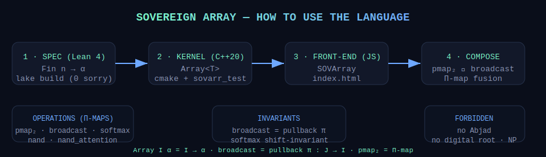

<!--OMEGA-FIELD:START-->
<div align="center">


</div>
<!--OMEGA-FIELD:END-->

---

<div align="center">

```
  ____  ____  ____  ____  ____  _  _  ___  ____  ____  _  _  ____  ____
 / ___)(  _ \\(  _ \\(  __)(    \\( \\/ )/ __)(  __)(  _ \\( \\/ )(  __)(  _ \\
 \\___ \\ )   / ) __/  ) _)  ) D ( \\  / \\__ \\ ) _)  ) __/ \\  /  ) _)  )   /
 (____/(__\\_)(__)   (____)(____/  \\/  (___/(____)(__)   (__)  (____)(__\\_)
        A R R A Y   L A N G U A G E   ·   A R R A Y   I  α  =  I  →  α
```

**Array I α = I → α &nbsp;·&nbsp; broadcast = pullback π : J → I &nbsp;·&nbsp; pmap₂ = Π-map &nbsp;·&nbsp; no sorry remains**

</div>

---

# Sovereign Array Language — Front-End

The **front-end** for the [Sovereign Array Language](../sovereign-array): an
interactive browser playground that runs the *same denotational semantics*
as the Lean 4 spec and the C++20 kernel — no Abjad, no digital root, no NP-magic.

> The denotational semantics of array computing *are* exactly a slice of
> dependent type theory. This front-end is the view layer over that substrate.

## What this repo is

| Layer | Repo | Role |
|-------|------|------|
| **Spec** | [`sovereign-array`](../sovereign-array) | Lean 4 — `Array I α = I → α`, zero-sorry proofs |
| **Kernel** | [`sovereign-array`](../sovereign-array) | C++20 — `Array<T>`, `pmap2`, `broadcast`, `softmax`, `nand_attention` |
| **Front-End** | **`sovereign-array-frontend`** (this repo) | Browser playground + usage guide |

## Quick Start

```bash
# Serve the playground (any static server)
cd sovereign-array-frontend
python -m http.server 8080
# open http://localhost:8080
```

No build step. Pure HTML/CSS/JS (ES modules).

## How to use the language

1. **Spec (Lean 4)** — define arrays as dependent functions `Fin n → α`;
   prove `broadcast_is_pullback` and `softmax_is_pmap` with `lake build` (zero sorry).
2. **Kernel (C++20)** — `#include "sovereign_array.h"`; build with CMake;
   run `sovarr_test` (11/11 checks).
3. **Front-end (this page)** — open `index.html`; the playground runs the
   same denotational semantics in the browser.
4. **Compose** — chain `pmap₂` / `broadcast` / `softmax` / `nand_attention`;
   fusion is Π-map fusion — no loop in the denotation.

## Usage Guide (SVG)



## Kernels demonstrated

| Kernel | Semantics | Status |
|--------|-----------|--------|
| `pmap₂` | Pointwise `Π`-map over index space `I` | ✅ |
| `broadcast` | Pullback along projection `π : J → I` | ✅ |
| `softmax` | `Π`-map normalization (shift-invariant) | ✅ |
| `nand` | Universal boolean gate | ✅ |
| `nand_attention` | NAND-extracted attention spec | ✅ |

## Layout

```
sovereign-array-frontend/
├── index.html          # Playground page
├── css/style.css       # Sovereign dark theme
├── js/
│   ├── array-lang.js   # Browser reference impl (SOVArray, broadcast, softmax, nand)
│   └── app.js          # Playground wiring
├── assets/
│   ├── logo.svg        # Σ · I → α mark
│   └── usage.svg       # SVG usage guide
└── README.md
```

## The forbidden list (fatal conflations we do NOT make)

- ❌ Proof `O(1)` substitution ⇒ `O(1)` decision procedure (NP stays hard)
- ❌ Abjad / digital root as universal arithmetic (quotients lose information)
- ❌ "Univalence replaces SIMD" (needs a compiler: Lean → C → LLVM → SIMD)

---

<div align="center">

**The substrate is always free. The array is a function.**

```
Array I α = I → α
broadcast  = pullback π
pmap₂      = Π-map
no sorry remains.
```

*Sovereign Array Language · Front-End · 2026 · Ahmad Ali Parr*

</div>
